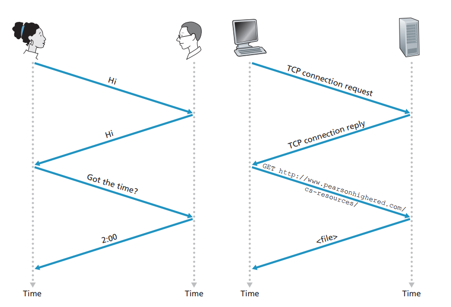
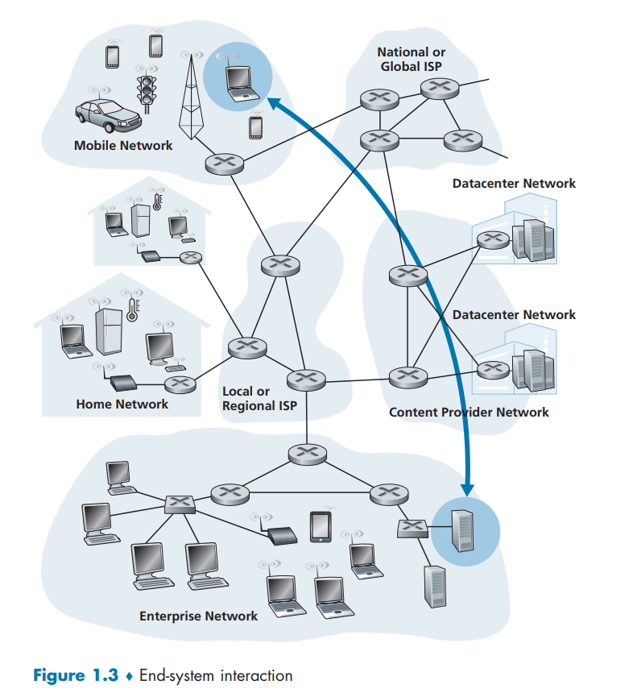
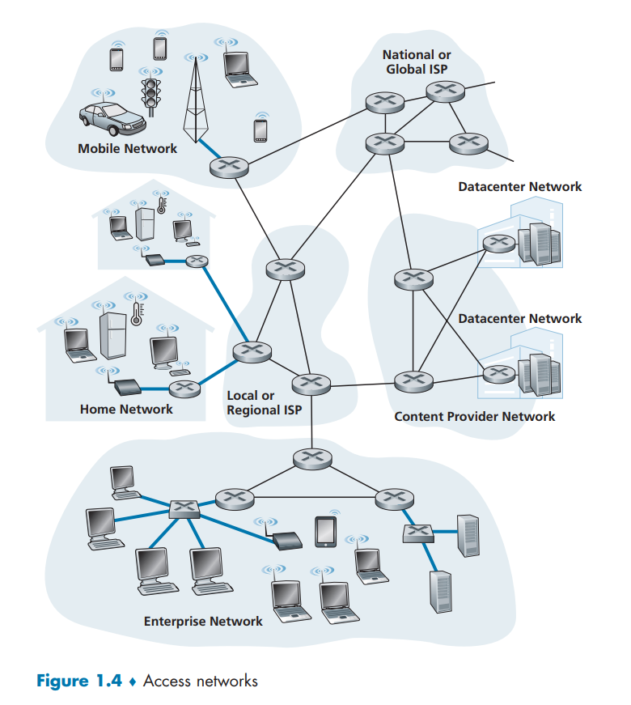
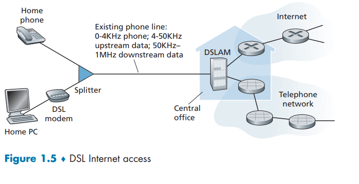
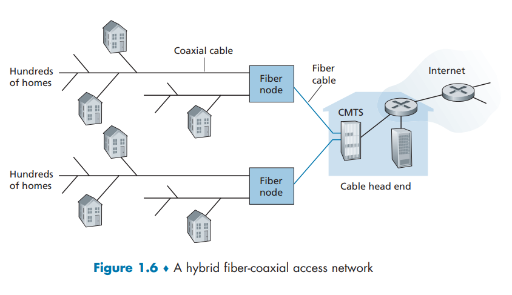
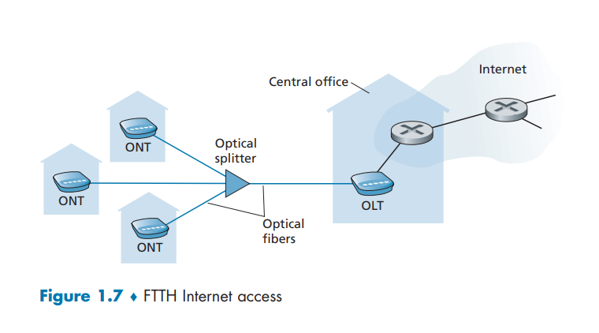

امروزه اینترنت را می‌توان به‌جرئت بزرگ‌ترین سامانه مهندسی‌شده‌ای دانست که بشر تاکنون خلق کرده است؛ سامانه‌ای با صدها میلیون رایانه، لینک‌های ارتباطی و سوئیچ‌های متصل به هم؛ با میلیاردها کاربری که از طریق لپ‌تاپ‌ها، تبلت‌ها و گوشی‌های هوشمند به آن متصل می‌شوند؛ و مجموعه‌ای از «اشیای» تازه متصل به اینترنت شامل کنسول‌های بازی، سامانه‌های نظارتی، ساعت‌ها، عینک‌ها، ترموستات‌ها و خودروها. با توجه به این‌که اینترنت بسیار عظیم است و اجزا و کاربردهای متنوعی دارد، آیا اصلاً امیدی به درک این‌که چگونه کار می‌کند وجود دارد؟ آیا اصول راهنما و ساختاری وجود دارند که بتوانند بنیانی برای فهم چنین سامانه عظیم و پیچیده‌ای فراهم کنند؟ و اگر چنین است، آیا ممکن است یادگیری شبکه‌های کامپیوتری در عین حال هم جالب و هم سرگرم‌کننده باشد؟ خوشبختانه پاسخ به تمام این پرسش‌ها یک «بله» قاطعانه است!
در حقیقت، هدف ما در این کتاب این است که مقدمه‌ای مدرن بر حوزه پویا و در حال تحول شبکه‌های کامپیوتری ارائه کنیم و اصول و بینش‌های عملی لازم را به شما بیاموزیم تا نه‌تنها شبکه‌های امروز، بلکه شبکه‌های فردا را نیز درک کنید.

این فصل نخست، مروری کلی بر شبکه‌های کامپیوتری و اینترنت ارائه می‌دهد. هدف ما در اینجا این است که تصویری وسیع و جامع ترسیم کنیم و زمینه‌ای برای ادامه کتاب فراهم آوریم؛ یعنی بتوانیم «جنگل را از میان درختان ببینیم». در این فصل مقدماتی، موضوعات متنوعی را مطرح می‌کنیم و اجزای مختلف یک شبکه کامپیوتری را بررسی خواهیم کرد، بدون این‌که از تصویر کلی غافل شویم.

ساختار مرور شبکه‌های کامپیوتری در این فصل به این ترتیب خواهد بود: پس از معرفی برخی مفاهیم و اصطلاحات پایه، ابتدا اجزای سخت‌افزاری و نرم‌افزاری اصلی یک شبکه را بررسی می‌کنیم. کار را از لبه شبکه آغاز می‌کنیم و به سراغ سیستم‌های انتهایی و برنامه‌های کاربردی شبکه‌ای که در شبکه اجرا می‌شوند می‌رویم. سپس به هسته شبکه کامپیوتری سر می‌زنیم و لینک‌ها و سوئیچ‌هایی را که داده‌ها را منتقل می‌کنند مطالعه خواهیم کرد، همچنین شبکه‌های دسترسی و رسانه‌های فیزیکی را بررسی می‌کنیم که سیستم‌های انتهایی را به هسته شبکه وصل می‌کنند. خواهیم آموخت که اینترنت درواقع شبکه‌ای از شبکه‌ها است و بررسی می‌کنیم این شبکه‌ها چگونه به یکدیگر متصل می‌شوند.

پس از کامل کردن این مرور بر اجزای لبه و هسته شبکه کامپیوتری، در نیمه دوم این فصل نگاهی وسیع‌تر و انتزاعی‌تر خواهیم داشت. به بررسی تأخیر، ازدست‌رفتن داده و توان عملیاتی در یک شبکه کامپیوتری می‌پردازیم و مدل‌های کمی ساده‌ای برای محاسبه تأخیر و توان انتها به انتها ارائه خواهیم کرد؛ مدل‌هایی که تأخیر انتقال، تأخیر انتشار و تأخیر صف‌بندی را در نظر می‌گیرند. سپس با برخی اصول معماری کلیدی در شبکه‌های کامپیوتری آشنا می‌شویم، ازجمله لایه‌بندی پروتکل‌ها و مدل‌های خدماتی. همچنین خواهیم آموخت که شبکه‌های کامپیوتری در برابر انواع مختلف حملات آسیب‌پذیر هستند؛ مروری بر این حملات خواهیم داشت و بررسی می‌کنیم چگونه می‌توان امنیت شبکه‌های کامپیوتری را افزایش داد. در نهایت، این فصل را با مروری کوتاه بر تاریخچه شبکه‌های کامپیوتری به پایان می‌بریم.

## 1.1 What Is the Internet?
در این کتاب، از اینترنت عمومی ـ که یک شبکه کامپیوتری مشخص است ـ به‌عنوان وسیله اصلی برای بحث درباره شبکه‌های کامپیوتری و پروتکل‌های آن‌ها استفاده خواهیم کرد. اما اینترنت چیست؟ برای پاسخ به این پرسش، می‌توان چند رویکرد داشت.

نخست، می‌توانیم به شرح جنبه‌های عملی و جزئیات اینترنت بپردازیم؛ یعنی اجزای سخت‌افزاری و نرم‌افزاری پایه‌ای که اینترنت را تشکیل می‌دهند. دوم، می‌توانیم اینترنت را به‌عنوان یک زیرساخت شبکه‌ای توصیف کنیم که خدماتی را در اختیار برنامه‌های کاربردی توزیع‌شده قرار می‌دهد.

بیایید با توصیف جنبه‌های عملی و اجزای سازنده آغاز کنیم و برای روشن‌تر شدن بحث، از شکل ۱.۱ استفاده کنیم.

## 1.1.1 A Nuts-and-Bolts Description
اینترنت یک شبکه کامپیوتری است که میلیاردها دستگاه محاسباتی را در سراسر جهان به هم متصل می‌کند. نه چندان دور، این دستگاه‌های محاسباتی عمدتاً رایانه‌های رومیزی سنتی، ایستگاه‌های کاری لینوکس و آنچه سرورها نامیده می‌شوند بودند که اطلاعاتی مانند صفحات وب و پیام‌های ایمیل را ذخیره و منتقل می‌کردند.

با این حال، به طور فزاینده‌ای، کاربران از طریق گوشی‌های هوشمند و تبلت‌ها به اینترنت متصل می‌شوند—امروزه نزدیک به نیمی از جمعیت جهان کاربران فعال اینترنت موبایل هستند و انتظار می‌رود این درصد تا سال 2025 به 75٪ برسد \[Statista 2019].

علاوه بر این، «اشیاء» غیرسنتی اینترنت مانند تلویزیون‌ها، کنسول‌های بازی، ترموستات‌ها، سیستم‌های امنیت خانگی، لوازم خانگی، ساعت‌ها، عینک‌ها، خودروها، سیستم‌های کنترل ترافیک و موارد دیگر نیز به اینترنت متصل می‌شوند.

در واقع، اصطلاح *شبکه کامپیوتری* کم‌کم قدیمی به نظر می‌رسد، با توجه به تعداد زیاد دستگاه‌های غیرسنتی که به اینترنت وصل می‌شوند. در اصطلاحات اینترنتی، به همه این دستگاه‌ها *میزبان* یا *سیستم پایانی* گفته می‌شود.

بر اساس برخی برآوردها، در سال 2017 حدود 18 میلیارد دستگاه به اینترنت متصل بوده‌اند و این تعداد تا سال 2022 به 28.5 میلیارد خواهد رسید \[Cisco VNI 2020].

سیستم‌های پایانی (End Systems) به‌وسیله شبکه‌ای از پیوندهای ارتباطی (Communication Links) و سوئیچ‌های بسته (Packet Switches) به هم متصل می‌شوند. همان‌طور که در بخش ۱.۲ خواهیم دید، انواع زیادی از پیوندهای ارتباطی وجود دارد که از رسانه‌های فیزیکی مختلفی ساخته شده‌اند، ازجمله کابل هم‌محور (Coaxial Cable)، سیم مسی، فیبر نوری و طیف رادیویی. پیوندهای مختلف می‌توانند داده‌ها را با نرخ‌های انتقال متفاوتی جابه‌جا کنند؛ نرخ انتقال یک پیوند بر حسب بیت بر ثانیه اندازه‌گیری می‌شود.

زمانی‌که یک سیستم پایانی داده‌ای برای ارسال به سیستم پایانی دیگر دارد، ابتدا داده‌ها را به بخش‌هایی تقسیم کرده و به هر بخش بایت‌های هدر اضافه می‌کند. این بسته‌های اطلاعاتی که در اصطلاح شبکه‌های کامپیوتری *بسته‌ها* (Packets) نامیده می‌شوند، از طریق شبکه به سیستم پایانی مقصد ارسال می‌شوند و در آنجا دوباره به داده اصلی بازسازی می‌شوند.

سوئیچ بسته، بسته‌ای را که از یکی از پیوندهای ارتباطی ورودی‌اش دریافت می‌کند، گرفته و آن را از طریق یکی از پیوندهای خروجی‌اش ارسال می‌کند. سوئیچ‌های بسته انواع مختلفی دارند، اما دو نوع اصلی آنها در اینترنت امروزی، *روترها* و *سوئیچ‌های لایه پیوند* هستند. هر دو نوع سوئیچ، بسته‌ها را به‌سمت مقصد نهایی هدایت می‌کنند. سوئیچ‌های لایه پیوند معمولاً در شبکه‌های دسترسی استفاده می‌شوند، در حالی که روترها بیشتر در هسته شبکه قرار دارند.

دنباله‌ای از پیوندهای ارتباطی و سوئیچ‌های بسته که یک بسته برای رسیدن از مبدأ به مقصد طی می‌کند، *مسیر* یا *راه* (Route or Path) نامیده می‌شود. شرکت سیسکو پیش‌بینی کرده که ترافیک IP جهانی سالانه تا سال ۲۰۲۲ به حدود پنج زتابایت (۱۰^۲۱ بایت) برسد \[Cisco VNI 2020].

شبکه‌های مبتنی بر سوئیچ بسته، از جهات مختلف به شبکه‌های حمل‌ونقل (جاده‌ها، بزرگراه‌ها و تقاطع‌ها) شباهت دارند. به‌عنوان مثال، کارخانه‌ای را تصور کنید که نیاز دارد حجم زیادی بار را به انبار مقصدی هزاران کیلومتر دورتر بفرستد. در کارخانه، بار به بخش‌هایی تقسیم و داخل کامیون‌ها بارگیری می‌شود. هر کامیون به‌طور مستقل از طریق شبکه جاده‌ها و بزرگراه‌ها به مقصد می‌رود. در انبار مقصد، بار تخلیه و دوباره تجمیع می‌شود.

بنابراین در بسیاری جهات، بسته‌ها مانند کامیون‌ها، پیوندهای ارتباطی مانند جاده‌ها، سوئیچ‌های بسته مانند تقاطع‌ها، و سیستم‌های پایانی مانند ساختمان‌ها هستند. همان‌طور که یک کامیون مسیری را در شبکه حمل‌ونقل طی می‌کند، یک بسته هم مسیری را در شبکه کامپیوتری طی می‌کند.

سیستم‌های پایانی از طریق *ارائه‌دهندگان خدمات اینترنت* (ISPs) به اینترنت دسترسی پیدا می‌کنند. این ISPs شامل ارائه‌دهندگان خانگی مانند شرکت‌های کابل یا تلفن محلی، ارائه‌دهندگان شرکتی، دانشگاهی، ارائه‌دهندگان WiFi در فرودگاه‌ها، هتل‌ها و مکان‌های عمومی، و ارائه‌دهندگان داده موبایل هستند که امکان دسترسی از طریق گوشی‌ها و دستگاه‌های دیگر را فراهم می‌کنند.

هر ISP خود شبکه‌ای از سوئیچ‌های بسته و پیوندهای ارتباطی است و انواع مختلفی از دسترسی را برای کاربران فراهم می‌کند، از جمله دسترسی باند پهن خانگی مثل مودم کابلی یا DSL، دسترسی پرسرعت LAN و دسترسی بی‌سیم موبایل. ISPs همچنین به ارائه‌دهندگان محتوا خدمات اتصال به اینترنت می‌دهند و سرورها را مستقیماً به اینترنت وصل می‌کنند.

چون اینترنت درباره اتصال سیستم‌های پایانی به یکدیگر است، ISPs پایین‌رده باید به ISPs بالارده در سطح ملی و بین‌المللی متصل شوند. ISPs بالارده نیز مستقیماً به یکدیگر متصل هستند. یک ISP بالارده از روترهای پرسرعت متصل به فیبرنوری‌های پرظرفیت تشکیل شده است. هر شبکه ISP چه بالارده چه پایین‌رده به‌طور مستقل مدیریت می‌شود، پروتکل IP را اجرا می‌کند و از قواعد نام‌گذاری و آدرس‌دهی مشخصی پیروی می‌کند.

سیستم‌های پایانی، سوئیچ‌های بسته و سایر اجزای اینترنت، *پروتکل‌هایی* را اجرا می‌کنند که کنترل ارسال و دریافت اطلاعات را بر عهده دارند. دو پروتکل بسیار مهم اینترنت عبارت‌اند از: *پروتکل کنترل انتقال* (TCP) و *پروتکل اینترنت* (IP). پروتکل IP قالب بسته‌هایی را مشخص می‌کند که میان روترها و سیستم‌های پایانی ردوبدل می‌شوند. پروتکل‌های اصلی اینترنت به‌طور کلی TCP/IP نامیده می‌شوند.

ازآنجا که پروتکل‌ها برای کارکرد درست اینترنت اهمیت حیاتی دارند، باید همه روی کارکرد دقیق هر پروتکل توافق داشته باشند تا سیستم‌ها و محصولات سازگار ساخته شوند. اینجاست که *استانداردها* اهمیت پیدا می‌کنند. استانداردهای اینترنت توسط *کارگروه مهندسی اینترنت* (IETF) تدوین می‌شود \[IETF 2020].

اسناد استاندارد IETF، *درخواست برای اظهارنظر* یا *RFC* نامیده می‌شوند. RFCها ابتدا به‌عنوان درخواست‌های عمومی برای نظر (و به همین دلیل این نام را گرفته‌اند) به‌منظور حل مشکلات طراحی شبکه و پروتکل‌های اینترنت اولیه مطرح شدند \[Allman 2011]. RFCها معمولاً بسیار فنی و دقیق هستند. این اسناد پروتکل‌هایی مانند TCP، IP، HTTP (برای وب) و SMTP (برای ایمیل) را تعریف می‌کنند. اکنون نزدیک به ۹۰۰۰ RFC وجود دارد.

سازمان‌های دیگری هم استانداردهایی را برای اجزای شبکه مشخص می‌کنند، به‌ویژه در حوزه پیوندهای شبکه. کمیته استانداردهای IEEE 802 LAN \[IEEE 802 2020] برای مثال استانداردهای اترنت و WiFi بی‌سیم را تعریف کرده است.

## 1.1.2 A Services Description
گفتگوی ما تاکنون بسیاری از اجزایی را که اینترنت را تشکیل می‌دهند شناسایی کرده است.
اما می‌توان اینترنت را از زاویه‌ای کاملاً متفاوت نیز توصیف کرد—یعنی به‌عنوان یک زیرساخت که به برنامه‌ها خدمات ارائه می‌دهد.
علاوه بر کاربردهای سنتی مانند ایمیل و مرور وب، کاربردهای اینترنتی شامل اپلیکیشن‌های موبایل در گوشی‌های هوشمند و تبلت‌ها نیز می‌شود، از جمله پیام‌رسانی اینترنتی، نقشه‌خوانی با اطلاعات ترافیک لحظه‌ای، پخش موسیقی، پخش فیلم و تلویزیون، شبکه‌های اجتماعی آنلاین، ویدئوکنفرانس، بازی‌های چندنفره، و سیستم‌های توصیه‌گر مبتنی بر موقعیت مکانی.

این برنامه‌ها **برنامه‌های توزیع‌شده** نامیده می‌شوند، زیرا شامل چندین سیستم انتهایی (End System) هستند که با یکدیگر داده مبادله می‌کنند.
نکته مهم این است که برنامه‌های اینترنتی روی سیستم‌های انتهایی اجرا می‌شوند—و نه روی سوئیچ‌های بسته (Packet Switches) در هسته شبکه.
اگرچه سوئیچ‌های بسته تبادل داده میان سیستم‌های انتهایی را امکان‌پذیر می‌کنند، اما به خود برنامه‌ای که مبدأ یا مقصد داده است، کاری ندارند.

بیایید کمی بیشتر بررسی کنیم که وقتی می‌گوییم اینترنت زیرساختی برای ارائه خدمات به برنامه‌هاست، منظورمان چیست.
برای این منظور، فرض کنید ایده‌ای هیجان‌انگیز برای یک برنامه توزیع‌شده اینترنتی دارید، برنامه‌ای که شاید کمک بزرگی به بشریت کند یا شاید صرفاً شما را ثروتمند و مشهور کند.
چگونه می‌توانید این ایده را به یک برنامه واقعی اینترنتی تبدیل کنید؟

چون برنامه‌ها روی سیستم‌های انتهایی اجرا می‌شوند، شما باید برنامه‌هایی بنویسید که روی این سیستم‌ها کار کنند.
مثلاً ممکن است برنامه‌های خود را با جاوا، C یا پایتون بنویسید.
حالا، چون در حال توسعه یک برنامه اینترنتی توزیع‌شده هستید، برنامه‌هایی که روی سیستم‌های انتهایی مختلف اجرا می‌شوند باید بتوانند داده‌ها را به یکدیگر ارسال کنند.
و در اینجا به یک موضوع اساسی می‌رسیم—موضوعی که به همان دیدگاه جایگزین در مورد اینترنت به‌عنوان بستری برای برنامه‌ها منجر می‌شود:
**چگونه یک برنامه که روی یک سیستم انتهایی اجرا می‌شود، به اینترنت دستور می‌دهد تا داده را به برنامه دیگری که روی سیستم انتهایی دیگری اجرا می‌شود، تحویل دهد؟**

سیستم‌های انتهایی متصل به اینترنت، یک **رابط سوکت (Socket Interface)** فراهم می‌کنند که مشخص می‌کند برنامه‌ای که روی یک سیستم انتهایی اجرا می‌شود، چگونه باید از اینترنت بخواهد داده را به مقصد موردنظرش ارسال کند.
این رابط سوکت مجموعه‌ای از قواعد است که برنامه فرستنده باید آن‌ها را رعایت کند تا اینترنت بتواند داده را به برنامه گیرنده تحویل دهد.
ما در فصل دوم این رابط سوکت اینترنت را با جزئیات بررسی خواهیم کرد.

فعلاً بیایید از یک قیاس ساده استفاده کنیم—قیاسی که در این کتاب بارها به آن اشاره خواهیم کرد:
فرض کنید آلیس می‌خواهد نامه‌ای برای باب از طریق پست ارسال کند.
آلیس نمی‌تواند تنها نامه را بنویسد (یعنی همان داده) و آن را از پنجره بیرون بیندازد.
بلکه اداره پست الزاماتی دارد: آلیس باید نامه را در پاکت بگذارد؛ نام کامل باب، نشانی و کد پستی او را روی پاکت بنویسد؛ پاکت را ببندد؛ در گوشه بالا سمت راست تمبر بچسباند؛ و در نهایت پاکت را در صندوق پست بیندازد.
بنابراین اداره پست یک «رابط خدمات پستی» یا مجموعه قواعد خاص خود دارد که آلیس باید آن‌ها را رعایت کند تا نامه‌اش به باب برسد.

به‌طور مشابه، اینترنت هم یک رابط سوکت دارد که برنامه فرستنده داده باید از آن پیروی کند تا اینترنت داده را به برنامه مقصد تحویل دهد.

اداره پست، البته، بیش از یک نوع خدمت به مشتریان ارائه می‌دهد.
خدماتی مانند تحویل سریع، دریافت تأییدیه وصول، خدمات معمولی و بسیاری دیگر.
به همین ترتیب، اینترنت هم خدمات مختلفی به برنامه‌هایش ارائه می‌دهد.
زمانی که شما یک برنامه اینترنتی توسعه می‌دهید، باید یکی از این خدمات اینترنت را برای برنامه خود انتخاب کنید.
ما این خدمات اینترنت را در فصل دوم شرح خواهیم داد.

تاکنون دو توصیف از اینترنت ارائه کردیم:
یکی از نظر اجزای سخت‌افزاری و نرم‌افزاری‌اش، دیگری از نظر زیرساختی که خدماتی را برای برنامه‌های توزیع‌شده فراهم می‌کند.

شاید هنوز هم درک اینکه اینترنت چیست برایتان دشوار باشد.
سوئیچ بسته و TCP/IP چه هستند؟
روترها چه نقشی دارند؟
چه انواعی از پیوندهای ارتباطی در اینترنت وجود دارند؟
برنامه توزیع‌شده دقیقاً چیست؟
چگونه می‌توان یک ترموستات یا ترازو را به اینترنت متصل کرد؟

اگر حالا کمی احساس سردرگمی می‌کنید، نگران نباشید—هدف این کتاب این است که هم اجزای فنی اینترنت را به شما معرفی کند و هم اصولی را که توضیح می‌دهد این فناوری چگونه و چرا کار می‌کند.
ما در بخش‌ها و فصل‌های بعدی این اصطلاحات و سؤالات مهم را با جزئیات توضیح خواهیم داد.

## 1.1.3 What Is a Protocol?
اکنون که کمی با اینترنت آشنا شده‌ایم، بیایید به یکی دیگر از واژه‌های مهم در شبکه‌های کامپیوتری بپردازیم: پروتکل.
پروتکل چیست؟ پروتکل چه کاری انجام می‌دهد؟

پروتکل مجموعه‌ای از قوانین و قراردادهاست که تعیین می‌کند دو یا چند کامپیوتر چگونه با یکدیگر ارتباط برقرار کنند.
پروتکل‌ها مشخص می‌کنند که چه اطلاعاتی باید ارسال شود، چگونه باید ارسال شود، و در صورت بروز خطا چه کاری باید انجام شود. به عبارت دیگر، پروتکل‌ها نظم و ساختار لازم برای تبادل اطلاعات در شبکه را فراهم می‌کنند.

### A Human Analogy
احتمالاً درک مفهوم پروتکل در شبکه‌های کامپیوتری با استفاده از یک مقایسه انسانی آسان‌تر است، چون ما انسان‌ها همیشه در حال اجرای نوعی پروتکل هستیم. تصور کنید زمانی که می‌خواهید از کسی ساعت را بپرسید، چه کاری انجام می‌دهید. یک گفت‌وگوی معمولی مانند چیزی است که در شکل 1.2 نشان داده شده است.
پروتکل انسانی (یا دست‌کم آداب معاشرت خوب) ایجاب می‌کند که ابتدا با یک سلام (اولین "سلام" در شکل 1.2) ارتباط را با طرف مقابل آغاز کنید. پاسخ معمول به یک "سلام"، یک "سلام" متقابل است. به‌صورت ضمنی، پاسخ مودبانه‌ی "سلام" نشانه‌ای از آمادگی برای ادامه‌ی گفتگو و پرسیدن ساعت است.
یک پاسخ متفاوت به "سلام" اولیه (مانند "مزاحمم نشو!" یا "من انگلیسی بلد نیستم" یا هر پاسخ توهین‌آمیز دیگر) ممکن است نشان‌دهنده‌ی عدم تمایل یا ناتوانی طرف مقابل برای ارتباط باشد. در این صورت، پروتکل انسانی حکم می‌کند که دیگر ساعت پرسیده نشود. گاهی هم ممکن است هیچ پاسخی دریافت نکنید، که در این حالت معمولاً از ادامه‌ی پرسش منصرف می‌شوید.

توجه داشته باشید که در این پروتکل انسانی، پیام‌های مشخصی ارسال می‌شود، و در واکنش به پیام‌های دریافتی یا اتفاقات دیگر (مثل عدم دریافت پاسخ در مدت زمان مشخص)، اقدامات مشخصی انجام می‌گیرد. روشن است که پیام‌های ارسال و دریافت‌شده، و اعمال انجام‌شده در واکنش به آن‌ها، نقش مرکزی در یک پروتکل انسانی دارند.
اگر افراد از پروتکل‌های متفاوتی استفاده کنند (برای مثال، اگر یکی آداب معاشرت داشته باشد و دیگری نه، یا یکی مفهوم زمان را درک کند و دیگری نه)، این پروتکل‌ها با هم سازگار نخواهند بود و هیچ ارتباط مفیدی برقرار نمی‌شود. در شبکه نیز همین‌طور است — برای انجام یک وظیفه، دو (یا چند) موجود ارتباط‌گیرنده باید از یک پروتکل مشترک استفاده کنند.

بیایید به مثال انسانی دوم بپردازیم.
فرض کنید در یک کلاس دانشگاهی هستید (مثلاً کلاس شبکه‌های کامپیوتری!). استاد در حال توضیح پروتکل‌هاست و شما گیج شده‌اید. استاد مکث می‌کند و می‌پرسد: «سؤالی هست؟» (پیامی که به تمام دانشجویانی که خواب نیستند ارسال و توسط آن‌ها دریافت می‌شود). شما دست‌تان را بالا می‌برید (پیامی ضمنی به استاد می‌فرستید). استاد با لبخند و گفتن «بفرمایید...» شما را تأیید می‌کند (پیامی برای تشویق شما به پرسش—استادها عاشق سؤال پرسیدن هستند)، و شما سؤال‌تان را می‌پرسید (یعنی پیامی به استاد ارسال می‌کنید). استاد سؤال شما را می‌شنود (پیام شما را دریافت می‌کند) و پاسخ می‌دهد (پاسخی برای شما می‌فرستد).

باز هم می‌بینیم که ارسال و دریافت پیام‌ها، و مجموعه‌ای از اعمال تعریف‌شده در واکنش به آن‌ها، در مرکز این پروتکل پرسش و پاسخ قرار دارند.

### Network Protocols
پروتکل شبکه شبیه پروتکل انسانی است، با این تفاوت که موجوداتی که پیام‌ها را رد و بدل کرده و اقداماتی انجام می‌دهند، اجزای سخت‌افزاری یا نرم‌افزاری برخی دستگاه‌ها هستند (مثلاً کامپیوتر، گوشی هوشمند، تبلت، روتر یا هر دستگاهی که قابلیت اتصال به شبکه دارد). تمام فعالیت‌های اینترنت که شامل دو یا چند موجود دور از هم هستند، توسط پروتکل کنترل می‌شود. برای مثال، پروتکل‌های پیاده‌سازی شده در سخت‌افزار در دو کامپیوتر که به صورت فیزیکی به هم متصل‌اند، جریان بیت‌ها روی “سیم” بین دو کارت شبکه را کنترل می‌کنند؛ پروتکل‌های کنترل ازدحام در سیستم‌های انتهایی، نرخ ارسال بسته‌ها بین فرستنده و گیرنده را کنترل می‌کنند؛ پروتکل‌ها در روترها مسیر بسته را از مبدا به مقصد تعیین می‌کنند. پروتکل‌ها در همه جای اینترنت در حال اجرا هستند و در نتیجه بخش بزرگی از این کتاب درباره پروتکل‌های شبکه کامپیوتری است.

به عنوان مثالی از یک پروتکل شبکه کامپیوتری که احتمالاً با آن آشنا هستید، در نظر بگیرید وقتی به یک سرور وب درخواست می‌دهید، یعنی زمانی که URL یک صفحه وب را در مرورگر خود تایپ می‌کنید، چه اتفاقی می‌افتد. این روند در نیمه راست شکل ۱.۲ نشان داده شده است. ابتدا کامپیوتر شما یک پیام درخواست اتصال به سرور وب ارسال می‌کند و منتظر پاسخ می‌ماند. سرور وب در نهایت پیام درخواست اتصال شما را دریافت کرده و یک پیام پاسخ اتصال ارسال می‌کند. وقتی کامپیوتر شما متوجه می‌شود که اکنون اجازه دارد درخواست سند وب را ارسال کند، نام صفحه وب مورد نظرش را در قالب پیام GET می‌فرستد. در نهایت، سرور وب صفحه وب (فایل) را به کامپیوتر شما بازمی‌گرداند.

با توجه به مثال‌های انسانی و شبکه‌ای فوق، تبادل پیام‌ها و اقداماتی که هنگام ارسال و دریافت این پیام‌ها انجام می‌شود، عناصر کلیدی تعریف پروتکل هستند:

پروتکل قالب و ترتیب پیام‌هایی که بین دو یا چند موجود ارتباطی رد و بدل می‌شود را تعریف می‌کند، همچنین اقداماتی که هنگام ارسال و/یا دریافت یک پیام یا رویداد دیگر باید انجام شود را مشخص می‌کند.

اینترنت و شبکه‌های کامپیوتری به طور گسترده‌ای از پروتکل‌ها استفاده می‌کنند. پروتکل‌های مختلف برای انجام وظایف مختلف ارتباطی به کار می‌روند.

با مطالعه این کتاب، خواهید فهمید که برخی پروتکل‌ها ساده و سرراست هستند، در حالی که برخی دیگر پیچیده و از نظر فکری عمیق‌اند. تسلط بر حوزه شبکه‌های کامپیوتری یعنی فهمیدن چیستی، چرایی و چگونگی پروتکل‌های شبکه.

## CASE HISTORY
مراکز داده و رایانش ابری
شرکت‌های اینترنتی مانند گوگل، مایکروسافت، آمازون و علی‌بابا، مراکز داده عظیمی ساخته‌اند که هر کدام شامل ده‌ها تا صدها هزار میزبان (host) هستند. این مراکز داده نه تنها به اینترنت متصل‌اند، همان‌طور که در شکل ۱.۱ نشان داده شده است، بلکه در داخل خود شامل شبکه‌های کامپیوتری پیچیده‌ای هستند که میزبان‌های مرکز داده را به هم متصل می‌کنند. مراکز داده موتور محرک برنامه‌های اینترنتی‌ای هستند که ما هر روز استفاده می‌کنیم.

به طور کلی، مراکز داده سه هدف اصلی را دنبال می‌کنند که در اینجا با اشاره به آمازون توضیح داده می‌شود. اول، آن‌ها صفحات تجارت الکترونیکی آمازون را به کاربران ارائه می‌دهند، مثلاً صفحاتی که محصولات و اطلاعات خرید را توضیح می‌دهند. دوم، به عنوان زیرساخت‌های محاسباتی بسیار موازی برای انجام پردازش داده‌های خاص آمازون عمل می‌کنند. سوم، خدمات رایانش ابری را به شرکت‌های دیگر ارائه می‌دهند. در واقع، امروزه یکی از روندهای اصلی در حوزه محاسبات این است که شرکت‌ها از ارائه‌دهنده رایانش ابری مانند آمازون استفاده می‌کنند تا تقریباً تمام نیازهای فناوری اطلاعات خود را مدیریت کنند. برای مثال، Airbnb و بسیاری دیگر از شرکت‌های مبتنی بر اینترنت، مالک و مدیر مراکز داده خود نیستند و به جای آن، کل خدمات وب خود را در فضای ابری آمازون، معروف به Amazon Web Services (AWS)، اجرا می‌کنند.

کارگرهای اصلی در یک مرکز داده میزبان‌ها هستند. آن‌ها محتوا (مثلاً صفحات وب و ویدئوها) را ارائه می‌دهند، ایمیل‌ها و اسناد را ذخیره می‌کنند و به صورت جمعی محاسبات توزیع‌شده بسیار گسترده انجام می‌دهند. میزبان‌های مرکز داده که به آن‌ها «بلید» (blades) گفته می‌شود و شبیه جعبه‌های پیتزا هستند، معمولاً میزبان‌های استاندارد شامل پردازنده (CPU)، حافظه و فضای ذخیره‌سازی دیسک هستند. میزبان‌ها در رک‌ها قرار دارند که هر رک معمولاً شامل ۲۰ تا ۴۰ بلید است. سپس رک‌ها با استفاده از طراحی‌های پیشرفته و در حال توسعه شبکه‌های مرکز داده به هم متصل می‌شوند. شبکه‌های مراکز داده در فصل ۶ به تفصیل بررسی شده‌اند.

## 1.2 The Network Edge
در بخش قبلی، مروری کلی و سطح بالا از اینترنت و پروتکل‌های شبکه ارائه دادیم. اکنون قصد داریم کمی عمیق‌تر به اجزای اینترنت بپردازیم. در این بخش، از لبه شبکه شروع می‌کنیم و به اجزایی می‌پردازیم که با آن‌ها بیشتر آشنا هستیم — یعنی کامپیوترها، گوشی‌های هوشمند و سایر دستگاه‌هایی که روزانه استفاده می‌کنیم. در بخش بعدی، از لبه شبکه به هسته شبکه حرکت می‌کنیم و به بررسی سوئیچینگ و مسیریابی در شبکه‌های کامپیوتری می‌پردازیم.

به یاد بیاورید که در اصطلاحات شبکه‌های کامپیوتری، کامپیوترها و سایر دستگاه‌های متصل به اینترنت اغلب به عنوان سیستم‌های انتهایی (End Systems) شناخته می‌شوند. این دستگاه‌ها «سیستم‌های انتهایی» نامیده می‌شوند چون در لبه اینترنت قرار دارند، همان‌طور که در شکل ۱.۳ نشان داده شده است. سیستم‌های انتهایی اینترنت شامل کامپیوترهای دسکتاپ (مثلاً دسکتاپ‌های پی‌سی، مک‌ها و دستگاه‌های لینوکسی)، سرورها (مثلاً سرورهای وب و ایمیل) و دستگاه‌های همراه (مثلاً لپ‌تاپ‌ها، گوشی‌های هوشمند و تبلت‌ها) هستند. علاوه بر این، تعداد فزاینده‌ای از «اشیاء» غیرسنتی نیز به عنوان سیستم‌های انتهایی به اینترنت متصل می‌شوند (به ویژگی «تاریخچه مورد» مراجعه کنید).

سیستم‌های انتهایی همچنین به عنوان میزبان‌ها (Hosts) شناخته می‌شوند، چون برنامه‌های کاربردی مانند مرورگر وب، سرور وب، برنامه‌های ایمیل یا سرور ایمیل را میزبانی (یعنی اجرا) می‌کنند. در سراسر این کتاب، ما از اصطلاحات میزبان و سیستم انتهایی به صورت مترادف استفاده خواهیم کرد؛ یعنی میزبان = سیستم انتهایی. میزبان‌ها گاهی به دو دسته تقسیم می‌شوند: کلاینت‌ها و سرورها. به طور غیررسمی، کلاینت‌ها معمولاً دسکتاپ‌ها، لپ‌تاپ‌ها، گوشی‌های هوشمند و موارد مشابه هستند، در حالی که سرورها معمولاً دستگاه‌های قدرتمندتری هستند که صفحات وب را ذخیره و توزیع می‌کنند، ویدئو استریم می‌کنند، ایمیل را منتقل می‌کنند و غیره. امروزه اکثر سرورهایی که ما از آن‌ها نتایج جستجو، ایمیل، صفحات وب، ویدئو و محتوای اپلیکیشن‌های موبایل دریافت می‌کنیم، در مراکز داده بزرگ قرار دارند. برای مثال، تا سال ۲۰۲۰، گوگل ۱۹ مرکز داده در چهار قاره دارد که جمعاً شامل چند میلیون سرور است. شکل ۱.۳ دو تا از این مراکز داده را نشان می‌دهد و ویژگی «تاریخچه مورد» درباره مراکز داده جزئیات بیشتری ارائه می‌دهد.

‍

## 1.2.1 Access Networks
پس از بررسی کاربردها و سیستم‌های انتهایی در «لبه شبکه»، اکنون به شبکه دسترسی می‌پردازیم — شبکه‌ای که به صورت فیزیکی یک سیستم انتهایی را به اولین روتر (که به آن «روتر لبه» نیز گفته می‌شود) در مسیر از سیستم انتهایی به هر سیستم انتهایی دوردست دیگر متصل می‌کند. شکل 1.4 چند نوع شبکه دسترسی را با خطوط ضخیم و سایه‌دار نشان می‌دهد و همچنین محیط‌هایی که این شبکه‌ها در آن‌ها استفاده می‌شوند (خانه، سازمان و شبکه بی‌سیم موبایل گسترده) را مشخص کرده است.

‍

## Home Access: DSL, Cable, FTTH, and 5G Fixed Wireless
تا سال ۲۰۲۰، بیش از ۸۰ درصد خانوارها در اروپا و ایالات متحده به اینترنت دسترسی داشتند [Statista 2019]. با توجه به استفاده گسترده از شبکه‌های دسترسی خانگی، بیایید بررسی شبکه‌های دسترسی را با نگاهی به نحوه اتصال خانه‌ها به اینترنت آغاز کنیم. امروزه، دو نوع رایج دسترسی پهن‌باند خانگی عبارتند از خط اشتراک دیجیتال (DSL) و کابل. معمولاً یک خانوار دسترسی DSL به اینترنت را از همان شرکت تلفن محلی (تلکو) که خدمات تلفن ثابت محلی را ارائه می‌دهد، دریافت می‌کند. بنابراین، هنگامی که از DSL استفاده می‌شود، شرکت تلکو همزمان ارائه‌دهنده خدمات اینترنت (ISP) نیز هست. همان‌طور که در شکل ۱.۵ نشان داده شده است، مودم DSL هر مشتری از خط تلفن موجود برای تبادل داده با یک مالتی‌پلکسر دسترسی خط اشتراک دیجیتال (DSLAM) که در دفتر مرکزی محلی (CO) تلکو قرار دارد، استفاده می‌کند. مودم DSL خانگی داده‌های دیجیتال را به سیگنال‌های فرکانس بالا برای انتقال از طریق خطوط تلفن به CO تبدیل می‌کند؛ سیگنال‌های آنالوگ از چندین خانه به فرمت دیجیتال در DSLAM بازگردانده می‌شوند.

خط تلفن خانگی به طور همزمان داده و سیگنال‌های تلفن سنتی را حمل می‌کند که در فرکانس‌های مختلف کدگذاری شده‌اند:
- یک کانال دانلود پرسرعت، در باند ۵۰ کیلوهرتز تا ۱ مگاهرتز
- یک کانال آپلود با سرعت متوسط، در باند ۴ کیلوهرتز تا ۵۰ کیلوهرتز
- یک کانال تلفن دوطرفه معمولی، در باند ۰ تا ۴ کیلوهرتز

این رویکرد باعث می‌شود یک لینک DSL واحد به‌گونه‌ای عمل کند که گویی سه لینک جداگانه وجود دارد، به طوری که تماس تلفنی و اتصال اینترنت می‌توانند به طور همزمان از لینک DSL استفاده کنند. (این تکنیک مالتی‌پلکسینگ تقسیم فرکانس در بخش ۱.۳.۱ توضیح داده خواهد شد.) در سمت مشتری، یک اسپلیتر (تقسیم‌کننده) سیگنال‌های داده و تلفن ورودی به خانه را جدا کرده و سیگنال داده را به مودم DSL هدایت می‌کند. در سمت تلکو، در دفتر مرکزی، DSLAM سیگنال‌های داده و تلفن را جدا کرده و داده‌ها را به اینترنت ارسال می‌کند. صدها یا حتی هزاران خانوار به یک DSLAM متصل می‌شوند.

استانداردهای DSL نرخ‌های انتقال متعددی را تعریف می‌کنند، از جمله نرخ‌های دانلود ۲۴ مگابیت بر ثانیه و ۵۲ مگابیت بر ثانیه، و نرخ‌های آپلود ۳.۵ مگابیت بر ثانیه و ۱۶ مگابیت بر ثانیه؛ جدیدترین استاندارد نرخ تجمعی دانلود و آپلود تا ۱ گیگابیت بر ثانیه را فراهم می‌کند [ITU 2014]. از آنجا که نرخ‌های دانلود و آپلود متفاوت هستند، این نوع دسترسی نامتقارن نامیده می‌شود. نرخ‌های واقعی دانلود و آپلود ممکن است کمتر از مقادیر ذکر شده باشد، زیرا ارائه‌دهنده DSL ممکن است نرخ خانگی را به طور عمدی محدود کند، به‌ویژه زمانی که خدمات چندسطحی (نرخ‌های مختلف با قیمت‌های متفاوت) ارائه می‌شود. حداکثر نرخ همچنین به فاصله بین خانه و CO، ضخامت خط جفت‌پیچیده (twisted-pair) و میزان تداخل الکتریکی بستگی دارد. مهندسان DSL را به طور خاص برای فواصل کوتاه بین خانه و CO طراحی کرده‌اند؛ به طور کلی، اگر خانه در فاصله ۵ تا ۱۰ مایل از CO قرار نداشته باشد، باید به نوع دیگری از دسترسی به اینترنت روی آورد.

در حالی که DSL از زیرساخت تلفن محلی موجود تلکو استفاده می‌کند، دسترسی به اینترنت کابلی از زیرساخت تلویزیون کابلی موجود شرکت‌های تلویزیون کابلی بهره می‌برد. یک خانوار دسترسی به اینترنت کابلی را از همان شرکتی که خدمات تلویزیون کابلی را ارائه می‌دهد، دریافت می‌کند. همان‌طور که در شکل ۱.۶ نشان داده شده است، فیبرهای نوری سرپوش کابل را به نقاط اتصال محله‌ای متصل می‌کنند، و از آنجا کابل کواکسیال سنتی برای رسیدن به خانه‌ها و آپارتمان‌های فردی استفاده می‌شود. هر نقطه اتصال محله‌ای معمولاً ۵۰۰ تا ۵,۰۰۰ خانه را پشتیبانی می‌کند. از آنجا که در این سیستم از فیبر نوری و کابل کواکسیال استفاده می‌شود، اغلب به آن فیبر-کواکسیال ترکیبی (HFC) گفته می‌شود.

دسترسی به اینترنت کابلی نیازمند مودم‌های خاصی به نام **مودم‌های کابلی** است. مشابه مودم DSL، مودم کابلی معمولاً یک دستگاه خارجی است و از طریق پورت اترنت به کامپیوتر خانگی متصل می‌شود. (اترنت در فصل ششم به تفصیل بررسی خواهد شد.) در سرپوش کابل، **سیستم پایان‌دهی مودم کابلی (CMTS)** عملکردی مشابه DSLAM در شبکه DSL دارد و سیگنال آنالوگ ارسال‌شده از مودم‌های کابلی در خانه‌های مختلف را به فرمت دیجیتال تبدیل می‌کند. مودم‌های کابلی شبکه HFC (فیبر-کواکسیال ترکیبی) را به دو کانال تقسیم می‌کنند: یک کانال دانلود و یک کانال آپلود. مشابه DSL، دسترسی معمولاً نامتقارن است، به طوری که کانال دانلود معمولاً نرخ انتقال بالاتری نسبت به کانال آپلود دارد. استانداردهای DOCSIS 2.0 و 3.0 نرخ‌های دانلود ۴۰ مگابیت بر ثانیه و ۱.۲ گیگابیت بر ثانیه و نرخ‌های آپلود ۳۰ مگابیت بر ثانیه و ۱۰۰ مگابیت بر ثانیه را به ترتیب تعریف می‌کنند. مشابه شبکه‌های DSL، حداکثر نرخ قابل دستیابی ممکن است به دلیل نرخ‌های قراردادی پایین‌تر یا مشکلات رسانه‌ای محقق نشود.

یکی از ویژگی‌های مهم دسترسی به اینترنت کابلی این است که یک رسانه پخش اشتراکی است. به طور خاص، هر بسته (پکت) ارسالی از سرپوش کابل در کانال دانلود به تمام لینک‌ها و تمام خانه‌ها منتقل می‌شود و هر بسته ارسالی از یک خانه در کانال آپلود به سرپوش کابل می‌رسد. به همین دلیل، اگر چندین کاربر به طور همزمان در حال دانلود یک فایل ویدئویی در کانال دانلود باشند، نرخ واقعی دریافت فایل ویدئویی برای هر کاربر به طور قابل‌توجهی کمتر از نرخ کلی دانلود کابلی خواهد بود. از سوی دیگر، اگر تعداد کمی کاربر فعال باشند و همه در حال وب‌گردی باشند، ممکن است هر کاربر صفحات وب را با نرخ کامل دانلود کابلی دریافت کند، زیرا کاربران به ندرت همزمان درخواست صفحه وب می‌دهند. از آنجا که کانال آپلود نیز اشتراکی است، به پروتکل دسترسی چندگانه توزیع‌شده نیاز است تا انتقال‌ها را هماهنگ کرده و از برخورد (collision) جلوگیری کند. (این مسئله برخورد در فصل ششم به تفصیل بحث خواهد شد.)

اگرچه DSL و کابل در حال حاضر بخش عمده دسترسی پهن‌باند خانگی در ایالات متحده را تشکیل می‌دهند، فناوری نوظهوری که سرعت‌های بالاتری ارائه می‌دهد، **فیبر به خانه (FTTH)** است [Fiber Broadband 2020]. همان‌طور که از نام آن پیداست، مفهوم FTTH ساده است: ارائه یک مسیر فیبر نوری مستقیم از دفتر مرکزی (CO) به خانه. FTTH می‌تواند نرخ‌های دسترسی به اینترنت در محدوده گیگابیت بر ثانیه را فراهم کند.

چندین فناوری رقیب برای توزیع نوری از CO به خانه‌ها وجود دارد. ساده‌ترین شبکه توزیع نوری، **فیبر مستقیم** است که در آن یک فیبر از CO به هر خانه کشیده می‌شود. اما معمولاً هر فیبر خروجی از دفتر مرکزی بین چندین خانه به اشتراک گذاشته می‌شود؛ این فیبر تا زمانی که به نزدیکی خانه‌ها نرسد، به فیبرهای اختصاصی برای هر مشتری تقسیم نمی‌شود. دو معماری شبکه توزیع نوری رقیب برای این تقسیم‌بندی وجود دارد: **شبکه‌های نوری فعال (AON)** و **شبکه‌های نوری غیرفعال (PON)**. AON اساساً اترنت سوئیچ‌شده است که در فصل ششم بحث می‌شود.

در اینجا به طور خلاصه به PON پرداخته می‌شود که در سرویس FiOS ورایزون استفاده می‌شود. شکل ۱.۷ معماری توزیع PON برای FTTH را نشان می‌دهد. هر خانه یک **پایان‌دهنده شبکه نوری (ONT)** دارد که از طریق فیبر نوری اختصاصی به یک **تقسیم‌کننده (Splitter)** محله‌ای متصل است. تقسیم‌کننده تعدادی خانه (معمولاً کمتر از ۱۰۰) را به یک فیبر نوری اشتراکی متصل می‌کند که به **پایان‌دهنده خط نوری (OLT)** در دفتر مرکزی تلکو متصل است. OLT، که تبدیل بین سیگنال‌های نوری و الکتریکی را انجام می‌دهد، از طریق یک روتر تلکو به اینترنت متصل می‌شود. در خانه، کاربران یک روتر خانگی (معمولاً یک روتر بی‌سیم) را به ONT متصل کرده و از طریق این روتر به اینترنت دسترسی پیدا می‌کنند. در معماری PON، تمام بسته‌های ارسالی از OLT به تقسیم‌کننده در تقسیم‌کننده تکثیر می‌شوند (مشابه سرپوش کابل).

علاوه بر DSL، کابل، و FTTH، فناوری **بی‌سیم ثابت 5G** نیز در حال گسترش است. بی‌سیم ثابت 5G نه تنها وعده دسترسی خانگی پرسرعت را می‌دهد، بلکه این کار را بدون نیاز به کابل‌کشی پرهزینه و مستعد خرابی از CO تلکو به خانه انجام می‌دهد. در بی‌سیم ثابت 5G، با استفاده از فناوری تشکیل پرتو (beam-forming)، داده‌ها به صورت بی‌سیم از ایستگاه پایه ارائه‌دهنده به یک مودم در خانه ارسال می‌شوند. یک روتر بی‌سیم Wi-Fi به مودم متصل می‌شود (که ممکن است با هم یکپارچه باشند)، مشابه نحوه اتصال روتر بی‌سیم Wi-Fi به مودم کابلی یا DSL. شبکه‌های سلولی 5G در فصل هفتم بررسی می‌شوند.

