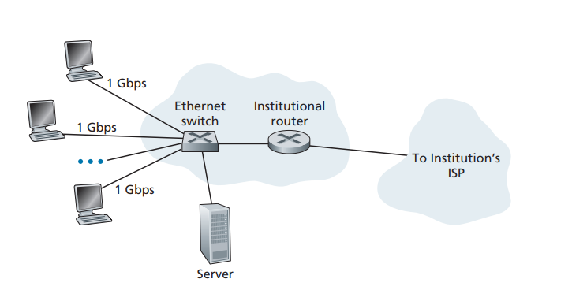
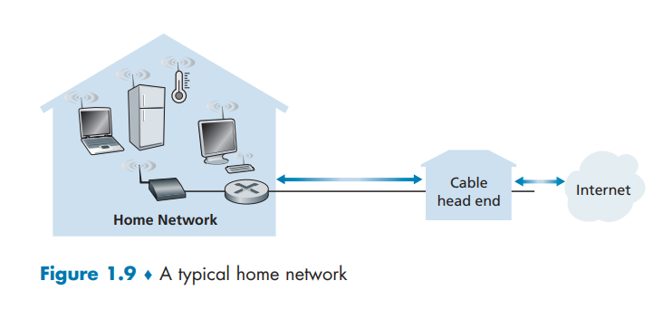
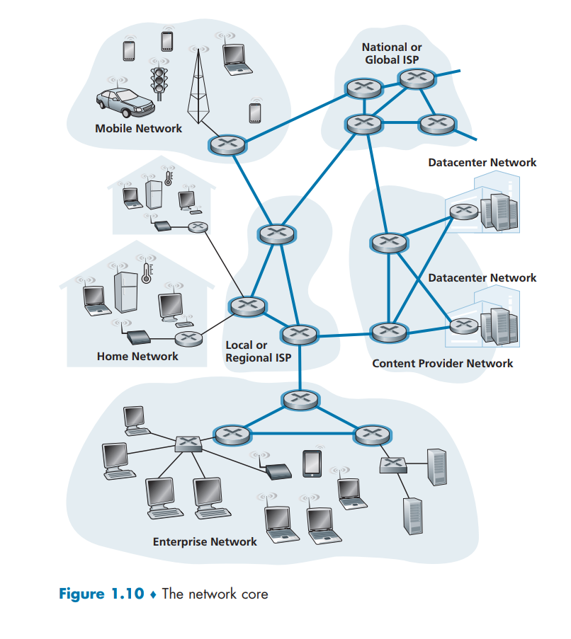
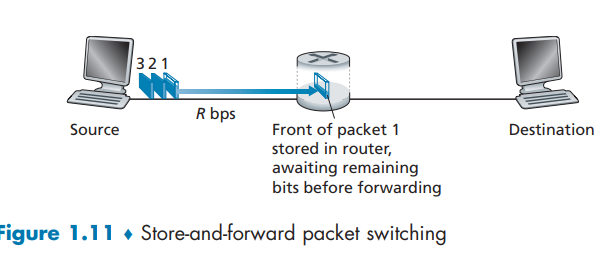
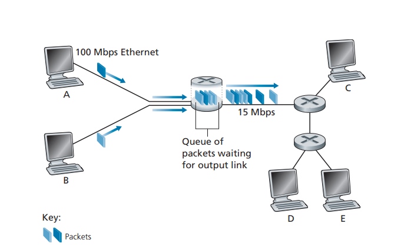

امروزه اینترنت را می‌توان به‌جرئت بزرگ‌ترین سامانه مهندسی‌شده‌ای دانست که بشر تاکنون خلق کرده است؛ سامانه‌ای با صدها میلیون رایانه، لینک‌های ارتباطی و سوئیچ‌های متصل به هم؛ با میلیاردها کاربری که از طریق لپ‌تاپ‌ها، تبلت‌ها و گوشی‌های هوشمند به آن متصل می‌شوند؛ و مجموعه‌ای از «اشیای» تازه متصل به اینترنت شامل کنسول‌های بازی، سامانه‌های نظارتی، ساعت‌ها، عینک‌ها، ترموستات‌ها و خودروها. با توجه به این‌که اینترنت بسیار عظیم است و اجزا و کاربردهای متنوعی دارد، آیا اصلاً امیدی به درک این‌که چگونه کار می‌کند وجود دارد؟ آیا اصول راهنما و ساختاری وجود دارند که بتوانند بنیانی برای فهم چنین سامانه عظیم و پیچیده‌ای فراهم کنند؟ و اگر چنین است، آیا ممکن است یادگیری شبکه‌های کامپیوتری در عین حال هم جالب و هم سرگرم‌کننده باشد؟ خوشبختانه پاسخ به تمام این پرسش‌ها یک «بله» قاطعانه است!
در حقیقت، هدف ما در این کتاب این است که مقدمه‌ای مدرن بر حوزه پویا و در حال تحول شبکه‌های کامپیوتری ارائه کنیم و اصول و بینش‌های عملی لازم را به شما بیاموزیم تا نه‌تنها شبکه‌های امروز، بلکه شبکه‌های فردا را نیز درک کنید.

این فصل نخست، مروری کلی بر شبکه‌های کامپیوتری و اینترنت ارائه می‌دهد. هدف ما در اینجا این است که تصویری وسیع و جامع ترسیم کنیم و زمینه‌ای برای ادامه کتاب فراهم آوریم؛ یعنی بتوانیم «جنگل را از میان درختان ببینیم». در این فصل مقدماتی، موضوعات متنوعی را مطرح می‌کنیم و اجزای مختلف یک شبکه کامپیوتری را بررسی خواهیم کرد، بدون این‌که از تصویر کلی غافل شویم.

ساختار مرور شبکه‌های کامپیوتری در این فصل به این ترتیب خواهد بود: پس از معرفی برخی مفاهیم و اصطلاحات پایه، ابتدا اجزای سخت‌افزاری و نرم‌افزاری اصلی یک شبکه را بررسی می‌کنیم. کار را از لبه شبکه آغاز می‌کنیم و به سراغ سیستم‌های انتهایی و برنامه‌های کاربردی شبکه‌ای که در شبکه اجرا می‌شوند می‌رویم. سپس به هسته شبکه کامپیوتری سر می‌زنیم و لینک‌ها و سوئیچ‌هایی را که داده‌ها را منتقل می‌کنند مطالعه خواهیم کرد، همچنین شبکه‌های دسترسی و رسانه‌های فیزیکی را بررسی می‌کنیم که سیستم‌های انتهایی را به هسته شبکه وصل می‌کنند. خواهیم آموخت که اینترنت درواقع شبکه‌ای از شبکه‌ها است و بررسی می‌کنیم این شبکه‌ها چگونه به یکدیگر متصل می‌شوند.

پس از کامل کردن این مرور بر اجزای لبه و هسته شبکه کامپیوتری، در نیمه دوم این فصل نگاهی وسیع‌تر و انتزاعی‌تر خواهیم داشت. به بررسی تأخیر، ازدست‌رفتن داده و توان عملیاتی در یک شبکه کامپیوتری می‌پردازیم و مدل‌های کمی ساده‌ای برای محاسبه تأخیر و توان انتها به انتها ارائه خواهیم کرد؛ مدل‌هایی که تأخیر انتقال، تأخیر انتشار و تأخیر صف‌بندی را در نظر می‌گیرند. سپس با برخی اصول معماری کلیدی در شبکه‌های کامپیوتری آشنا می‌شویم، ازجمله لایه‌بندی پروتکل‌ها و مدل‌های خدماتی. همچنین خواهیم آموخت که شبکه‌های کامپیوتری در برابر انواع مختلف حملات آسیب‌پذیر هستند؛ مروری بر این حملات خواهیم داشت و بررسی می‌کنیم چگونه می‌توان امنیت شبکه‌های کامپیوتری را افزایش داد. در نهایت، این فصل را با مروری کوتاه بر تاریخچه شبکه‌های کامپیوتری به پایان می‌بریم.

## 1.1 What Is the Internet?
در این کتاب، از اینترنت عمومی ـ که یک شبکه کامپیوتری مشخص است ـ به‌عنوان وسیله اصلی برای بحث درباره شبکه‌های کامپیوتری و پروتکل‌های آن‌ها استفاده خواهیم کرد. اما اینترنت چیست؟ برای پاسخ به این پرسش، می‌توان چند رویکرد داشت.

نخست، می‌توانیم به شرح جنبه‌های عملی و جزئیات اینترنت بپردازیم؛ یعنی اجزای سخت‌افزاری و نرم‌افزاری پایه‌ای که اینترنت را تشکیل می‌دهند. دوم، می‌توانیم اینترنت را به‌عنوان یک زیرساخت شبکه‌ای توصیف کنیم که خدماتی را در اختیار برنامه‌های کاربردی توزیع‌شده قرار می‌دهد.

بیایید با توصیف جنبه‌های عملی و اجزای سازنده آغاز کنیم و برای روشن‌تر شدن بحث، از شکل ۱.۱ استفاده کنیم.

## 1.1.1 A Nuts-and-Bolts Description
اینترنت یک شبکه کامپیوتری است که میلیاردها دستگاه محاسباتی را در سراسر جهان به هم متصل می‌کند. نه چندان دور، این دستگاه‌های محاسباتی عمدتاً رایانه‌های رومیزی سنتی، ایستگاه‌های کاری لینوکس و آنچه سرورها نامیده می‌شوند بودند که اطلاعاتی مانند صفحات وب و پیام‌های ایمیل را ذخیره و منتقل می‌کردند.

با این حال، به طور فزاینده‌ای، کاربران از طریق گوشی‌های هوشمند و تبلت‌ها به اینترنت متصل می‌شوند—امروزه نزدیک به نیمی از جمعیت جهان کاربران فعال اینترنت موبایل هستند و انتظار می‌رود این درصد تا سال 2025 به 75٪ برسد \[Statista 2019].

علاوه بر این، «اشیاء» غیرسنتی اینترنت مانند تلویزیون‌ها، کنسول‌های بازی، ترموستات‌ها، سیستم‌های امنیت خانگی، لوازم خانگی، ساعت‌ها، عینک‌ها، خودروها، سیستم‌های کنترل ترافیک و موارد دیگر نیز به اینترنت متصل می‌شوند.

در واقع، اصطلاح *شبکه کامپیوتری* کم‌کم قدیمی به نظر می‌رسد، با توجه به تعداد زیاد دستگاه‌های غیرسنتی که به اینترنت وصل می‌شوند. در اصطلاحات اینترنتی، به همه این دستگاه‌ها *میزبان* یا *سیستم پایانی* گفته می‌شود.

بر اساس برخی برآوردها، در سال 2017 حدود 18 میلیارد دستگاه به اینترنت متصل بوده‌اند و این تعداد تا سال 2022 به 28.5 میلیارد خواهد رسید \[Cisco VNI 2020].

سیستم‌های پایانی (End Systems) به‌وسیله شبکه‌ای از پیوندهای ارتباطی (Communication Links) و سوئیچ‌های بسته (Packet Switches) به هم متصل می‌شوند. همان‌طور که در بخش ۱.۲ خواهیم دید، انواع زیادی از پیوندهای ارتباطی وجود دارد که از رسانه‌های فیزیکی مختلفی ساخته شده‌اند، ازجمله کابل هم‌محور (Coaxial Cable)، سیم مسی، فیبر نوری و طیف رادیویی. پیوندهای مختلف می‌توانند داده‌ها را با نرخ‌های انتقال متفاوتی جابه‌جا کنند؛ نرخ انتقال یک پیوند بر حسب بیت بر ثانیه اندازه‌گیری می‌شود.

زمانی‌که یک سیستم پایانی داده‌ای برای ارسال به سیستم پایانی دیگر دارد، ابتدا داده‌ها را به بخش‌هایی تقسیم کرده و به هر بخش بایت‌های هدر اضافه می‌کند. این بسته‌های اطلاعاتی که در اصطلاح شبکه‌های کامپیوتری *بسته‌ها* (Packets) نامیده می‌شوند، از طریق شبکه به سیستم پایانی مقصد ارسال می‌شوند و در آنجا دوباره به داده اصلی بازسازی می‌شوند.

سوئیچ بسته، بسته‌ای را که از یکی از پیوندهای ارتباطی ورودی‌اش دریافت می‌کند، گرفته و آن را از طریق یکی از پیوندهای خروجی‌اش ارسال می‌کند. سوئیچ‌های بسته انواع مختلفی دارند، اما دو نوع اصلی آنها در اینترنت امروزی، *روترها* و *سوئیچ‌های لایه پیوند* هستند. هر دو نوع سوئیچ، بسته‌ها را به‌سمت مقصد نهایی هدایت می‌کنند. سوئیچ‌های لایه پیوند معمولاً در شبکه‌های دسترسی استفاده می‌شوند، در حالی که روترها بیشتر در هسته شبکه قرار دارند.

دنباله‌ای از پیوندهای ارتباطی و سوئیچ‌های بسته که یک بسته برای رسیدن از مبدأ به مقصد طی می‌کند، *مسیر* یا *راه* (Route or Path) نامیده می‌شود. شرکت سیسکو پیش‌بینی کرده که ترافیک IP جهانی سالانه تا سال ۲۰۲۲ به حدود پنج زتابایت (۱۰^۲۱ بایت) برسد \[Cisco VNI 2020].

شبکه‌های مبتنی بر سوئیچ بسته، از جهات مختلف به شبکه‌های حمل‌ونقل (جاده‌ها، بزرگراه‌ها و تقاطع‌ها) شباهت دارند. به‌عنوان مثال، کارخانه‌ای را تصور کنید که نیاز دارد حجم زیادی بار را به انبار مقصدی هزاران کیلومتر دورتر بفرستد. در کارخانه، بار به بخش‌هایی تقسیم و داخل کامیون‌ها بارگیری می‌شود. هر کامیون به‌طور مستقل از طریق شبکه جاده‌ها و بزرگراه‌ها به مقصد می‌رود. در انبار مقصد، بار تخلیه و دوباره تجمیع می‌شود.

بنابراین در بسیاری جهات، بسته‌ها مانند کامیون‌ها، پیوندهای ارتباطی مانند جاده‌ها، سوئیچ‌های بسته مانند تقاطع‌ها، و سیستم‌های پایانی مانند ساختمان‌ها هستند. همان‌طور که یک کامیون مسیری را در شبکه حمل‌ونقل طی می‌کند، یک بسته هم مسیری را در شبکه کامپیوتری طی می‌کند.

سیستم‌های پایانی از طریق *ارائه‌دهندگان خدمات اینترنت* (ISPs) به اینترنت دسترسی پیدا می‌کنند. این ISPs شامل ارائه‌دهندگان خانگی مانند شرکت‌های کابل یا تلفن محلی، ارائه‌دهندگان شرکتی، دانشگاهی، ارائه‌دهندگان WiFi در فرودگاه‌ها، هتل‌ها و مکان‌های عمومی، و ارائه‌دهندگان داده موبایل هستند که امکان دسترسی از طریق گوشی‌ها و دستگاه‌های دیگر را فراهم می‌کنند.

هر ISP خود شبکه‌ای از سوئیچ‌های بسته و پیوندهای ارتباطی است و انواع مختلفی از دسترسی را برای کاربران فراهم می‌کند، از جمله دسترسی باند پهن خانگی مثل مودم کابلی یا DSL، دسترسی پرسرعت LAN و دسترسی بی‌سیم موبایل. ISPs همچنین به ارائه‌دهندگان محتوا خدمات اتصال به اینترنت می‌دهند و سرورها را مستقیماً به اینترنت وصل می‌کنند.

چون اینترنت درباره اتصال سیستم‌های پایانی به یکدیگر است، ISPs پایین‌رده باید به ISPs بالارده در سطح ملی و بین‌المللی متصل شوند. ISPs بالارده نیز مستقیماً به یکدیگر متصل هستند. یک ISP بالارده از روترهای پرسرعت متصل به فیبرنوری‌های پرظرفیت تشکیل شده است. هر شبکه ISP چه بالارده چه پایین‌رده به‌طور مستقل مدیریت می‌شود، پروتکل IP را اجرا می‌کند و از قواعد نام‌گذاری و آدرس‌دهی مشخصی پیروی می‌کند.

سیستم‌های پایانی، سوئیچ‌های بسته و سایر اجزای اینترنت، *پروتکل‌هایی* را اجرا می‌کنند که کنترل ارسال و دریافت اطلاعات را بر عهده دارند. دو پروتکل بسیار مهم اینترنت عبارت‌اند از: *پروتکل کنترل انتقال* (TCP) و *پروتکل اینترنت* (IP). پروتکل IP قالب بسته‌هایی را مشخص می‌کند که میان روترها و سیستم‌های پایانی ردوبدل می‌شوند. پروتکل‌های اصلی اینترنت به‌طور کلی TCP/IP نامیده می‌شوند.

ازآنجا که پروتکل‌ها برای کارکرد درست اینترنت اهمیت حیاتی دارند، باید همه روی کارکرد دقیق هر پروتکل توافق داشته باشند تا سیستم‌ها و محصولات سازگار ساخته شوند. اینجاست که *استانداردها* اهمیت پیدا می‌کنند. استانداردهای اینترنت توسط *کارگروه مهندسی اینترنت* (IETF) تدوین می‌شود \[IETF 2020].

اسناد استاندارد IETF، *درخواست برای اظهارنظر* یا *RFC* نامیده می‌شوند. RFCها ابتدا به‌عنوان درخواست‌های عمومی برای نظر (و به همین دلیل این نام را گرفته‌اند) به‌منظور حل مشکلات طراحی شبکه و پروتکل‌های اینترنت اولیه مطرح شدند \[Allman 2011]. RFCها معمولاً بسیار فنی و دقیق هستند. این اسناد پروتکل‌هایی مانند TCP، IP، HTTP (برای وب) و SMTP (برای ایمیل) را تعریف می‌کنند. اکنون نزدیک به ۹۰۰۰ RFC وجود دارد.

سازمان‌های دیگری هم استانداردهایی را برای اجزای شبکه مشخص می‌کنند، به‌ویژه در حوزه پیوندهای شبکه. کمیته استانداردهای IEEE 802 LAN \[IEEE 802 2020] برای مثال استانداردهای اترنت و WiFi بی‌سیم را تعریف کرده است.

## 1.1.2 A Services Description
گفتگوی ما تاکنون بسیاری از اجزایی را که اینترنت را تشکیل می‌دهند شناسایی کرده است.
اما می‌توان اینترنت را از زاویه‌ای کاملاً متفاوت نیز توصیف کرد—یعنی به‌عنوان یک زیرساخت که به برنامه‌ها خدمات ارائه می‌دهد.
علاوه بر کاربردهای سنتی مانند ایمیل و مرور وب، کاربردهای اینترنتی شامل اپلیکیشن‌های موبایل در گوشی‌های هوشمند و تبلت‌ها نیز می‌شود، از جمله پیام‌رسانی اینترنتی، نقشه‌خوانی با اطلاعات ترافیک لحظه‌ای، پخش موسیقی، پخش فیلم و تلویزیون، شبکه‌های اجتماعی آنلاین، ویدئوکنفرانس، بازی‌های چندنفره، و سیستم‌های توصیه‌گر مبتنی بر موقعیت مکانی.

این برنامه‌ها **برنامه‌های توزیع‌شده** نامیده می‌شوند، زیرا شامل چندین سیستم انتهایی (End System) هستند که با یکدیگر داده مبادله می‌کنند.
نکته مهم این است که برنامه‌های اینترنتی روی سیستم‌های انتهایی اجرا می‌شوند—و نه روی سوئیچ‌های بسته (Packet Switches) در هسته شبکه.
اگرچه سوئیچ‌های بسته تبادل داده میان سیستم‌های انتهایی را امکان‌پذیر می‌کنند، اما به خود برنامه‌ای که مبدأ یا مقصد داده است، کاری ندارند.

بیایید کمی بیشتر بررسی کنیم که وقتی می‌گوییم اینترنت زیرساختی برای ارائه خدمات به برنامه‌هاست، منظورمان چیست.
برای این منظور، فرض کنید ایده‌ای هیجان‌انگیز برای یک برنامه توزیع‌شده اینترنتی دارید، برنامه‌ای که شاید کمک بزرگی به بشریت کند یا شاید صرفاً شما را ثروتمند و مشهور کند.
چگونه می‌توانید این ایده را به یک برنامه واقعی اینترنتی تبدیل کنید؟

چون برنامه‌ها روی سیستم‌های انتهایی اجرا می‌شوند، شما باید برنامه‌هایی بنویسید که روی این سیستم‌ها کار کنند.
مثلاً ممکن است برنامه‌های خود را با جاوا، C یا پایتون بنویسید.
حالا، چون در حال توسعه یک برنامه اینترنتی توزیع‌شده هستید، برنامه‌هایی که روی سیستم‌های انتهایی مختلف اجرا می‌شوند باید بتوانند داده‌ها را به یکدیگر ارسال کنند.
و در اینجا به یک موضوع اساسی می‌رسیم—موضوعی که به همان دیدگاه جایگزین در مورد اینترنت به‌عنوان بستری برای برنامه‌ها منجر می‌شود:
**چگونه یک برنامه که روی یک سیستم انتهایی اجرا می‌شود، به اینترنت دستور می‌دهد تا داده را به برنامه دیگری که روی سیستم انتهایی دیگری اجرا می‌شود، تحویل دهد؟**

سیستم‌های انتهایی متصل به اینترنت، یک **رابط سوکت (Socket Interface)** فراهم می‌کنند که مشخص می‌کند برنامه‌ای که روی یک سیستم انتهایی اجرا می‌شود، چگونه باید از اینترنت بخواهد داده را به مقصد موردنظرش ارسال کند.
این رابط سوکت مجموعه‌ای از قواعد است که برنامه فرستنده باید آن‌ها را رعایت کند تا اینترنت بتواند داده را به برنامه گیرنده تحویل دهد.
ما در فصل دوم این رابط سوکت اینترنت را با جزئیات بررسی خواهیم کرد.

فعلاً بیایید از یک قیاس ساده استفاده کنیم—قیاسی که در این کتاب بارها به آن اشاره خواهیم کرد:
فرض کنید آلیس می‌خواهد نامه‌ای برای باب از طریق پست ارسال کند.
آلیس نمی‌تواند تنها نامه را بنویسد (یعنی همان داده) و آن را از پنجره بیرون بیندازد.
بلکه اداره پست الزاماتی دارد: آلیس باید نامه را در پاکت بگذارد؛ نام کامل باب، نشانی و کد پستی او را روی پاکت بنویسد؛ پاکت را ببندد؛ در گوشه بالا سمت راست تمبر بچسباند؛ و در نهایت پاکت را در صندوق پست بیندازد.
بنابراین اداره پست یک «رابط خدمات پستی» یا مجموعه قواعد خاص خود دارد که آلیس باید آن‌ها را رعایت کند تا نامه‌اش به باب برسد.

به‌طور مشابه، اینترنت هم یک رابط سوکت دارد که برنامه فرستنده داده باید از آن پیروی کند تا اینترنت داده را به برنامه مقصد تحویل دهد.

اداره پست، البته، بیش از یک نوع خدمت به مشتریان ارائه می‌دهد.
خدماتی مانند تحویل سریع، دریافت تأییدیه وصول، خدمات معمولی و بسیاری دیگر.
به همین ترتیب، اینترنت هم خدمات مختلفی به برنامه‌هایش ارائه می‌دهد.
زمانی که شما یک برنامه اینترنتی توسعه می‌دهید، باید یکی از این خدمات اینترنت را برای برنامه خود انتخاب کنید.
ما این خدمات اینترنت را در فصل دوم شرح خواهیم داد.

تاکنون دو توصیف از اینترنت ارائه کردیم:
یکی از نظر اجزای سخت‌افزاری و نرم‌افزاری‌اش، دیگری از نظر زیرساختی که خدماتی را برای برنامه‌های توزیع‌شده فراهم می‌کند.

شاید هنوز هم درک اینکه اینترنت چیست برایتان دشوار باشد.
سوئیچ بسته و TCP/IP چه هستند؟
روترها چه نقشی دارند؟
چه انواعی از پیوندهای ارتباطی در اینترنت وجود دارند؟
برنامه توزیع‌شده دقیقاً چیست؟
چگونه می‌توان یک ترموستات یا ترازو را به اینترنت متصل کرد؟

اگر حالا کمی احساس سردرگمی می‌کنید، نگران نباشید—هدف این کتاب این است که هم اجزای فنی اینترنت را به شما معرفی کند و هم اصولی را که توضیح می‌دهد این فناوری چگونه و چرا کار می‌کند.
ما در بخش‌ها و فصل‌های بعدی این اصطلاحات و سؤالات مهم را با جزئیات توضیح خواهیم داد.

## 1.1.3 What Is a Protocol?
اکنون که کمی با اینترنت آشنا شده‌ایم، بیایید به یکی دیگر از واژه‌های مهم در شبکه‌های کامپیوتری بپردازیم: پروتکل.
پروتکل چیست؟ پروتکل چه کاری انجام می‌دهد؟

پروتکل مجموعه‌ای از قوانین و قراردادهاست که تعیین می‌کند دو یا چند کامپیوتر چگونه با یکدیگر ارتباط برقرار کنند.
پروتکل‌ها مشخص می‌کنند که چه اطلاعاتی باید ارسال شود، چگونه باید ارسال شود، و در صورت بروز خطا چه کاری باید انجام شود. به عبارت دیگر، پروتکل‌ها نظم و ساختار لازم برای تبادل اطلاعات در شبکه را فراهم می‌کنند.

### A Human Analogy
احتمالاً درک مفهوم پروتکل در شبکه‌های کامپیوتری با استفاده از یک مقایسه انسانی آسان‌تر است، چون ما انسان‌ها همیشه در حال اجرای نوعی پروتکل هستیم. تصور کنید زمانی که می‌خواهید از کسی ساعت را بپرسید، چه کاری انجام می‌دهید. یک گفت‌وگوی معمولی مانند چیزی است که در شکل 1.2 نشان داده شده است.
پروتکل انسانی (یا دست‌کم آداب معاشرت خوب) ایجاب می‌کند که ابتدا با یک سلام (اولین "سلام" در شکل 1.2) ارتباط را با طرف مقابل آغاز کنید. پاسخ معمول به یک "سلام"، یک "سلام" متقابل است. به‌صورت ضمنی، پاسخ مودبانه‌ی "سلام" نشانه‌ای از آمادگی برای ادامه‌ی گفتگو و پرسیدن ساعت است.
یک پاسخ متفاوت به "سلام" اولیه (مانند "مزاحمم نشو!" یا "من انگلیسی بلد نیستم" یا هر پاسخ توهین‌آمیز دیگر) ممکن است نشان‌دهنده‌ی عدم تمایل یا ناتوانی طرف مقابل برای ارتباط باشد. در این صورت، پروتکل انسانی حکم می‌کند که دیگر ساعت پرسیده نشود. گاهی هم ممکن است هیچ پاسخی دریافت نکنید، که در این حالت معمولاً از ادامه‌ی پرسش منصرف می‌شوید.

توجه داشته باشید که در این پروتکل انسانی، پیام‌های مشخصی ارسال می‌شود، و در واکنش به پیام‌های دریافتی یا اتفاقات دیگر (مثل عدم دریافت پاسخ در مدت زمان مشخص)، اقدامات مشخصی انجام می‌گیرد. روشن است که پیام‌های ارسال و دریافت‌شده، و اعمال انجام‌شده در واکنش به آن‌ها، نقش مرکزی در یک پروتکل انسانی دارند.
اگر افراد از پروتکل‌های متفاوتی استفاده کنند (برای مثال، اگر یکی آداب معاشرت داشته باشد و دیگری نه، یا یکی مفهوم زمان را درک کند و دیگری نه)، این پروتکل‌ها با هم سازگار نخواهند بود و هیچ ارتباط مفیدی برقرار نمی‌شود. در شبکه نیز همین‌طور است — برای انجام یک وظیفه، دو (یا چند) موجود ارتباط‌گیرنده باید از یک پروتکل مشترک استفاده کنند.

بیایید به مثال انسانی دوم بپردازیم.
فرض کنید در یک کلاس دانشگاهی هستید (مثلاً کلاس شبکه‌های کامپیوتری!). استاد در حال توضیح پروتکل‌هاست و شما گیج شده‌اید. استاد مکث می‌کند و می‌پرسد: «سؤالی هست؟» (پیامی که به تمام دانشجویانی که خواب نیستند ارسال و توسط آن‌ها دریافت می‌شود). شما دست‌تان را بالا می‌برید (پیامی ضمنی به استاد می‌فرستید). استاد با لبخند و گفتن «بفرمایید...» شما را تأیید می‌کند (پیامی برای تشویق شما به پرسش—استادها عاشق سؤال پرسیدن هستند)، و شما سؤال‌تان را می‌پرسید (یعنی پیامی به استاد ارسال می‌کنید). استاد سؤال شما را می‌شنود (پیام شما را دریافت می‌کند) و پاسخ می‌دهد (پاسخی برای شما می‌فرستد).

باز هم می‌بینیم که ارسال و دریافت پیام‌ها، و مجموعه‌ای از اعمال تعریف‌شده در واکنش به آن‌ها، در مرکز این پروتکل پرسش و پاسخ قرار دارند.

### Network Protocols
پروتکل شبکه شبیه پروتکل انسانی است، با این تفاوت که موجوداتی که پیام‌ها را رد و بدل کرده و اقداماتی انجام می‌دهند، اجزای سخت‌افزاری یا نرم‌افزاری برخی دستگاه‌ها هستند (مثلاً کامپیوتر، گوشی هوشمند، تبلت، روتر یا هر دستگاهی که قابلیت اتصال به شبکه دارد). تمام فعالیت‌های اینترنت که شامل دو یا چند موجود دور از هم هستند، توسط پروتکل کنترل می‌شود. برای مثال، پروتکل‌های پیاده‌سازی شده در سخت‌افزار در دو کامپیوتر که به صورت فیزیکی به هم متصل‌اند، جریان بیت‌ها روی “سیم” بین دو کارت شبکه را کنترل می‌کنند؛ پروتکل‌های کنترل ازدحام در سیستم‌های انتهایی، نرخ ارسال بسته‌ها بین فرستنده و گیرنده را کنترل می‌کنند؛ پروتکل‌ها در روترها مسیر بسته را از مبدا به مقصد تعیین می‌کنند. پروتکل‌ها در همه جای اینترنت در حال اجرا هستند و در نتیجه بخش بزرگی از این کتاب درباره پروتکل‌های شبکه کامپیوتری است.

به عنوان مثالی از یک پروتکل شبکه کامپیوتری که احتمالاً با آن آشنا هستید، در نظر بگیرید وقتی به یک سرور وب درخواست می‌دهید، یعنی زمانی که URL یک صفحه وب را در مرورگر خود تایپ می‌کنید، چه اتفاقی می‌افتد. این روند در نیمه راست شکل ۱.۲ نشان داده شده است. ابتدا کامپیوتر شما یک پیام درخواست اتصال به سرور وب ارسال می‌کند و منتظر پاسخ می‌ماند. سرور وب در نهایت پیام درخواست اتصال شما را دریافت کرده و یک پیام پاسخ اتصال ارسال می‌کند. وقتی کامپیوتر شما متوجه می‌شود که اکنون اجازه دارد درخواست سند وب را ارسال کند، نام صفحه وب مورد نظرش را در قالب پیام GET می‌فرستد. در نهایت، سرور وب صفحه وب (فایل) را به کامپیوتر شما بازمی‌گرداند.

با توجه به مثال‌های انسانی و شبکه‌ای فوق، تبادل پیام‌ها و اقداماتی که هنگام ارسال و دریافت این پیام‌ها انجام می‌شود، عناصر کلیدی تعریف پروتکل هستند:

پروتکل قالب و ترتیب پیام‌هایی که بین دو یا چند موجود ارتباطی رد و بدل می‌شود را تعریف می‌کند، همچنین اقداماتی که هنگام ارسال و/یا دریافت یک پیام یا رویداد دیگر باید انجام شود را مشخص می‌کند.

اینترنت و شبکه‌های کامپیوتری به طور گسترده‌ای از پروتکل‌ها استفاده می‌کنند. پروتکل‌های مختلف برای انجام وظایف مختلف ارتباطی به کار می‌روند.

با مطالعه این کتاب، خواهید فهمید که برخی پروتکل‌ها ساده و سرراست هستند، در حالی که برخی دیگر پیچیده و از نظر فکری عمیق‌اند. تسلط بر حوزه شبکه‌های کامپیوتری یعنی فهمیدن چیستی، چرایی و چگونگی پروتکل‌های شبکه.

## CASE HISTORY
مراکز داده و رایانش ابری
شرکت‌های اینترنتی مانند گوگل، مایکروسافت، آمازون و علی‌بابا، مراکز داده عظیمی ساخته‌اند که هر کدام شامل ده‌ها تا صدها هزار میزبان (host) هستند. این مراکز داده نه تنها به اینترنت متصل‌اند، همان‌طور که در شکل ۱.۱ نشان داده شده است، بلکه در داخل خود شامل شبکه‌های کامپیوتری پیچیده‌ای هستند که میزبان‌های مرکز داده را به هم متصل می‌کنند. مراکز داده موتور محرک برنامه‌های اینترنتی‌ای هستند که ما هر روز استفاده می‌کنیم.

به طور کلی، مراکز داده سه هدف اصلی را دنبال می‌کنند که در اینجا با اشاره به آمازون توضیح داده می‌شود. اول، آن‌ها صفحات تجارت الکترونیکی آمازون را به کاربران ارائه می‌دهند، مثلاً صفحاتی که محصولات و اطلاعات خرید را توضیح می‌دهند. دوم، به عنوان زیرساخت‌های محاسباتی بسیار موازی برای انجام پردازش داده‌های خاص آمازون عمل می‌کنند. سوم، خدمات رایانش ابری را به شرکت‌های دیگر ارائه می‌دهند. در واقع، امروزه یکی از روندهای اصلی در حوزه محاسبات این است که شرکت‌ها از ارائه‌دهنده رایانش ابری مانند آمازون استفاده می‌کنند تا تقریباً تمام نیازهای فناوری اطلاعات خود را مدیریت کنند. برای مثال، Airbnb و بسیاری دیگر از شرکت‌های مبتنی بر اینترنت، مالک و مدیر مراکز داده خود نیستند و به جای آن، کل خدمات وب خود را در فضای ابری آمازون، معروف به Amazon Web Services (AWS)، اجرا می‌کنند.

کارگرهای اصلی در یک مرکز داده میزبان‌ها هستند. آن‌ها محتوا (مثلاً صفحات وب و ویدئوها) را ارائه می‌دهند، ایمیل‌ها و اسناد را ذخیره می‌کنند و به صورت جمعی محاسبات توزیع‌شده بسیار گسترده انجام می‌دهند. میزبان‌های مرکز داده که به آن‌ها «بلید» (blades) گفته می‌شود و شبیه جعبه‌های پیتزا هستند، معمولاً میزبان‌های استاندارد شامل پردازنده (CPU)، حافظه و فضای ذخیره‌سازی دیسک هستند. میزبان‌ها در رک‌ها قرار دارند که هر رک معمولاً شامل ۲۰ تا ۴۰ بلید است. سپس رک‌ها با استفاده از طراحی‌های پیشرفته و در حال توسعه شبکه‌های مرکز داده به هم متصل می‌شوند. شبکه‌های مراکز داده در فصل ۶ به تفصیل بررسی شده‌اند.

## 1.2 The Network Edge
در بخش قبلی، مروری کلی و سطح بالا از اینترنت و پروتکل‌های شبکه ارائه دادیم. اکنون قصد داریم کمی عمیق‌تر به اجزای اینترنت بپردازیم. در این بخش، از لبه شبکه شروع می‌کنیم و به اجزایی می‌پردازیم که با آن‌ها بیشتر آشنا هستیم — یعنی کامپیوترها، گوشی‌های هوشمند و سایر دستگاه‌هایی که روزانه استفاده می‌کنیم. در بخش بعدی، از لبه شبکه به هسته شبکه حرکت می‌کنیم و به بررسی سوئیچینگ و مسیریابی در شبکه‌های کامپیوتری می‌پردازیم.

به یاد بیاورید که در اصطلاحات شبکه‌های کامپیوتری، کامپیوترها و سایر دستگاه‌های متصل به اینترنت اغلب به عنوان سیستم‌های انتهایی (End Systems) شناخته می‌شوند. این دستگاه‌ها «سیستم‌های انتهایی» نامیده می‌شوند چون در لبه اینترنت قرار دارند، همان‌طور که در شکل ۱.۳ نشان داده شده است. سیستم‌های انتهایی اینترنت شامل کامپیوترهای دسکتاپ (مثلاً دسکتاپ‌های پی‌سی، مک‌ها و دستگاه‌های لینوکسی)، سرورها (مثلاً سرورهای وب و ایمیل) و دستگاه‌های همراه (مثلاً لپ‌تاپ‌ها، گوشی‌های هوشمند و تبلت‌ها) هستند. علاوه بر این، تعداد فزاینده‌ای از «اشیاء» غیرسنتی نیز به عنوان سیستم‌های انتهایی به اینترنت متصل می‌شوند (به ویژگی «تاریخچه مورد» مراجعه کنید).

سیستم‌های انتهایی همچنین به عنوان میزبان‌ها (Hosts) شناخته می‌شوند، چون برنامه‌های کاربردی مانند مرورگر وب، سرور وب، برنامه‌های ایمیل یا سرور ایمیل را میزبانی (یعنی اجرا) می‌کنند. در سراسر این کتاب، ما از اصطلاحات میزبان و سیستم انتهایی به صورت مترادف استفاده خواهیم کرد؛ یعنی میزبان = سیستم انتهایی. میزبان‌ها گاهی به دو دسته تقسیم می‌شوند: کلاینت‌ها و سرورها. به طور غیررسمی، کلاینت‌ها معمولاً دسکتاپ‌ها، لپ‌تاپ‌ها، گوشی‌های هوشمند و موارد مشابه هستند، در حالی که سرورها معمولاً دستگاه‌های قدرتمندتری هستند که صفحات وب را ذخیره و توزیع می‌کنند، ویدئو استریم می‌کنند، ایمیل را منتقل می‌کنند و غیره. امروزه اکثر سرورهایی که ما از آن‌ها نتایج جستجو، ایمیل، صفحات وب، ویدئو و محتوای اپلیکیشن‌های موبایل دریافت می‌کنیم، در مراکز داده بزرگ قرار دارند. برای مثال، تا سال ۲۰۲۰، گوگل ۱۹ مرکز داده در چهار قاره دارد که جمعاً شامل چند میلیون سرور است. شکل ۱.۳ دو تا از این مراکز داده را نشان می‌دهد و ویژگی «تاریخچه مورد» درباره مراکز داده جزئیات بیشتری ارائه می‌دهد.

‍

## 1.2.1 Access Networks
پس از بررسی کاربردها و سیستم‌های انتهایی در «لبه شبکه»، اکنون به شبکه دسترسی می‌پردازیم — شبکه‌ای که به صورت فیزیکی یک سیستم انتهایی را به اولین روتر (که به آن «روتر لبه» نیز گفته می‌شود) در مسیر از سیستم انتهایی به هر سیستم انتهایی دوردست دیگر متصل می‌کند. شکل 1.4 چند نوع شبکه دسترسی را با خطوط ضخیم و سایه‌دار نشان می‌دهد و همچنین محیط‌هایی که این شبکه‌ها در آن‌ها استفاده می‌شوند (خانه، سازمان و شبکه بی‌سیم موبایل گسترده) را مشخص کرده است.

‍

## Home Access: DSL, Cable, FTTH, and 5G Fixed Wireless
تا سال ۲۰۲۰، بیش از ۸۰ درصد خانوارها در اروپا و ایالات متحده به اینترنت دسترسی داشتند [Statista 2019]. با توجه به استفاده گسترده از شبکه‌های دسترسی خانگی، بیایید بررسی شبکه‌های دسترسی را با نگاهی به نحوه اتصال خانه‌ها به اینترنت آغاز کنیم. امروزه، دو نوع رایج دسترسی پهن‌باند خانگی عبارتند از خط اشتراک دیجیتال (DSL) و کابل. معمولاً یک خانوار دسترسی DSL به اینترنت را از همان شرکت تلفن محلی (تلکو) که خدمات تلفن ثابت محلی را ارائه می‌دهد، دریافت می‌کند. بنابراین، هنگامی که از DSL استفاده می‌شود، شرکت تلکو همزمان ارائه‌دهنده خدمات اینترنت (ISP) نیز هست. همان‌طور که در شکل ۱.۵ نشان داده شده است، مودم DSL هر مشتری از خط تلفن موجود برای تبادل داده با یک مالتی‌پلکسر دسترسی خط اشتراک دیجیتال (DSLAM) که در دفتر مرکزی محلی (CO) تلکو قرار دارد، استفاده می‌کند. مودم DSL خانگی داده‌های دیجیتال را به سیگنال‌های فرکانس بالا برای انتقال از طریق خطوط تلفن به CO تبدیل می‌کند؛ سیگنال‌های آنالوگ از چندین خانه به فرمت دیجیتال در DSLAM بازگردانده می‌شوند.

خط تلفن خانگی به طور همزمان داده و سیگنال‌های تلفن سنتی را حمل می‌کند که در فرکانس‌های مختلف کدگذاری شده‌اند:
- یک کانال دانلود پرسرعت، در باند ۵۰ کیلوهرتز تا ۱ مگاهرتز
- یک کانال آپلود با سرعت متوسط، در باند ۴ کیلوهرتز تا ۵۰ کیلوهرتز
- یک کانال تلفن دوطرفه معمولی، در باند ۰ تا ۴ کیلوهرتز

این رویکرد باعث می‌شود یک لینک DSL واحد به‌گونه‌ای عمل کند که گویی سه لینک جداگانه وجود دارد، به طوری که تماس تلفنی و اتصال اینترنت می‌توانند به طور همزمان از لینک DSL استفاده کنند. (این تکنیک مالتی‌پلکسینگ تقسیم فرکانس در بخش ۱.۳.۱ توضیح داده خواهد شد.) در سمت مشتری، یک اسپلیتر (تقسیم‌کننده) سیگنال‌های داده و تلفن ورودی به خانه را جدا کرده و سیگنال داده را به مودم DSL هدایت می‌کند. در سمت تلکو، در دفتر مرکزی، DSLAM سیگنال‌های داده و تلفن را جدا کرده و داده‌ها را به اینترنت ارسال می‌کند. صدها یا حتی هزاران خانوار به یک DSLAM متصل می‌شوند.

استانداردهای DSL نرخ‌های انتقال متعددی را تعریف می‌کنند، از جمله نرخ‌های دانلود ۲۴ مگابیت بر ثانیه و ۵۲ مگابیت بر ثانیه، و نرخ‌های آپلود ۳.۵ مگابیت بر ثانیه و ۱۶ مگابیت بر ثانیه؛ جدیدترین استاندارد نرخ تجمعی دانلود و آپلود تا ۱ گیگابیت بر ثانیه را فراهم می‌کند [ITU 2014]. از آنجا که نرخ‌های دانلود و آپلود متفاوت هستند، این نوع دسترسی نامتقارن نامیده می‌شود. نرخ‌های واقعی دانلود و آپلود ممکن است کمتر از مقادیر ذکر شده باشد، زیرا ارائه‌دهنده DSL ممکن است نرخ خانگی را به طور عمدی محدود کند، به‌ویژه زمانی که خدمات چندسطحی (نرخ‌های مختلف با قیمت‌های متفاوت) ارائه می‌شود. حداکثر نرخ همچنین به فاصله بین خانه و CO، ضخامت خط جفت‌پیچیده (twisted-pair) و میزان تداخل الکتریکی بستگی دارد. مهندسان DSL را به طور خاص برای فواصل کوتاه بین خانه و CO طراحی کرده‌اند؛ به طور کلی، اگر خانه در فاصله ۵ تا ۱۰ مایل از CO قرار نداشته باشد، باید به نوع دیگری از دسترسی به اینترنت روی آورد.

در حالی که DSL از زیرساخت تلفن محلی موجود تلکو استفاده می‌کند، دسترسی به اینترنت کابلی از زیرساخت تلویزیون کابلی موجود شرکت‌های تلویزیون کابلی بهره می‌برد. یک خانوار دسترسی به اینترنت کابلی را از همان شرکتی که خدمات تلویزیون کابلی را ارائه می‌دهد، دریافت می‌کند. همان‌طور که در شکل ۱.۶ نشان داده شده است، فیبرهای نوری سرپوش کابل را به نقاط اتصال محله‌ای متصل می‌کنند، و از آنجا کابل کواکسیال سنتی برای رسیدن به خانه‌ها و آپارتمان‌های فردی استفاده می‌شود. هر نقطه اتصال محله‌ای معمولاً ۵۰۰ تا ۵,۰۰۰ خانه را پشتیبانی می‌کند. از آنجا که در این سیستم از فیبر نوری و کابل کواکسیال استفاده می‌شود، اغلب به آن فیبر-کواکسیال ترکیبی (HFC) گفته می‌شود.

دسترسی به اینترنت کابلی نیازمند مودم‌های خاصی به نام **مودم‌های کابلی** است. مشابه مودم DSL، مودم کابلی معمولاً یک دستگاه خارجی است و از طریق پورت اترنت به کامپیوتر خانگی متصل می‌شود. (اترنت در فصل ششم به تفصیل بررسی خواهد شد.) در سرپوش کابل، **سیستم پایان‌دهی مودم کابلی (CMTS)** عملکردی مشابه DSLAM در شبکه DSL دارد و سیگنال آنالوگ ارسال‌شده از مودم‌های کابلی در خانه‌های مختلف را به فرمت دیجیتال تبدیل می‌کند. مودم‌های کابلی شبکه HFC (فیبر-کواکسیال ترکیبی) را به دو کانال تقسیم می‌کنند: یک کانال دانلود و یک کانال آپلود. مشابه DSL، دسترسی معمولاً نامتقارن است، به طوری که کانال دانلود معمولاً نرخ انتقال بالاتری نسبت به کانال آپلود دارد. استانداردهای DOCSIS 2.0 و 3.0 نرخ‌های دانلود ۴۰ مگابیت بر ثانیه و ۱.۲ گیگابیت بر ثانیه و نرخ‌های آپلود ۳۰ مگابیت بر ثانیه و ۱۰۰ مگابیت بر ثانیه را به ترتیب تعریف می‌کنند. مشابه شبکه‌های DSL، حداکثر نرخ قابل دستیابی ممکن است به دلیل نرخ‌های قراردادی پایین‌تر یا مشکلات رسانه‌ای محقق نشود.

یکی از ویژگی‌های مهم دسترسی به اینترنت کابلی این است که یک رسانه پخش اشتراکی است. به طور خاص، هر بسته (پکت) ارسالی از سرپوش کابل در کانال دانلود به تمام لینک‌ها و تمام خانه‌ها منتقل می‌شود و هر بسته ارسالی از یک خانه در کانال آپلود به سرپوش کابل می‌رسد. به همین دلیل، اگر چندین کاربر به طور همزمان در حال دانلود یک فایل ویدئویی در کانال دانلود باشند، نرخ واقعی دریافت فایل ویدئویی برای هر کاربر به طور قابل‌توجهی کمتر از نرخ کلی دانلود کابلی خواهد بود. از سوی دیگر، اگر تعداد کمی کاربر فعال باشند و همه در حال وب‌گردی باشند، ممکن است هر کاربر صفحات وب را با نرخ کامل دانلود کابلی دریافت کند، زیرا کاربران به ندرت همزمان درخواست صفحه وب می‌دهند. از آنجا که کانال آپلود نیز اشتراکی است، به پروتکل دسترسی چندگانه توزیع‌شده نیاز است تا انتقال‌ها را هماهنگ کرده و از برخورد (collision) جلوگیری کند. (این مسئله برخورد در فصل ششم به تفصیل بحث خواهد شد.)

اگرچه DSL و کابل در حال حاضر بخش عمده دسترسی پهن‌باند خانگی در ایالات متحده را تشکیل می‌دهند، فناوری نوظهوری که سرعت‌های بالاتری ارائه می‌دهد، **فیبر به خانه (FTTH)** است [Fiber Broadband 2020]. همان‌طور که از نام آن پیداست، مفهوم FTTH ساده است: ارائه یک مسیر فیبر نوری مستقیم از دفتر مرکزی (CO) به خانه. FTTH می‌تواند نرخ‌های دسترسی به اینترنت در محدوده گیگابیت بر ثانیه را فراهم کند.

چندین فناوری رقیب برای توزیع نوری از CO به خانه‌ها وجود دارد. ساده‌ترین شبکه توزیع نوری، **فیبر مستقیم** است که در آن یک فیبر از CO به هر خانه کشیده می‌شود. اما معمولاً هر فیبر خروجی از دفتر مرکزی بین چندین خانه به اشتراک گذاشته می‌شود؛ این فیبر تا زمانی که به نزدیکی خانه‌ها نرسد، به فیبرهای اختصاصی برای هر مشتری تقسیم نمی‌شود. دو معماری شبکه توزیع نوری رقیب برای این تقسیم‌بندی وجود دارد: **شبکه‌های نوری فعال (AON)** و **شبکه‌های نوری غیرفعال (PON)**. AON اساساً اترنت سوئیچ‌شده است که در فصل ششم بحث می‌شود.

در اینجا به طور خلاصه به PON پرداخته می‌شود که در سرویس FiOS ورایزون استفاده می‌شود. شکل ۱.۷ معماری توزیع PON برای FTTH را نشان می‌دهد. هر خانه یک **پایان‌دهنده شبکه نوری (ONT)** دارد که از طریق فیبر نوری اختصاصی به یک **تقسیم‌کننده (Splitter)** محله‌ای متصل است. تقسیم‌کننده تعدادی خانه (معمولاً کمتر از ۱۰۰) را به یک فیبر نوری اشتراکی متصل می‌کند که به **پایان‌دهنده خط نوری (OLT)** در دفتر مرکزی تلکو متصل است. OLT، که تبدیل بین سیگنال‌های نوری و الکتریکی را انجام می‌دهد، از طریق یک روتر تلکو به اینترنت متصل می‌شود. در خانه، کاربران یک روتر خانگی (معمولاً یک روتر بی‌سیم) را به ONT متصل کرده و از طریق این روتر به اینترنت دسترسی پیدا می‌کنند. در معماری PON، تمام بسته‌های ارسالی از OLT به تقسیم‌کننده در تقسیم‌کننده تکثیر می‌شوند (مشابه سرپوش کابل).

علاوه بر DSL، کابل، و FTTH، فناوری **بی‌سیم ثابت 5G** نیز در حال گسترش است. بی‌سیم ثابت 5G نه تنها وعده دسترسی خانگی پرسرعت را می‌دهد، بلکه این کار را بدون نیاز به کابل‌کشی پرهزینه و مستعد خرابی از CO تلکو به خانه انجام می‌دهد. در بی‌سیم ثابت 5G، با استفاده از فناوری تشکیل پرتو (beam-forming)، داده‌ها به صورت بی‌سیم از ایستگاه پایه ارائه‌دهنده به یک مودم در خانه ارسال می‌شوند. یک روتر بی‌سیم Wi-Fi به مودم متصل می‌شود (که ممکن است با هم یکپارچه باشند)، مشابه نحوه اتصال روتر بی‌سیم Wi-Fi به مودم کابلی یا DSL. شبکه‌های سلولی 5G در فصل هفتم بررسی می‌شوند.

## Access in the Enterprise (and the Home): Ethernet and WiFi
در محوطه‌های شرکت‌ها و دانشگاه‌ها، و همچنین به‌طور فزاینده‌ای در محیط‌های خانگی، یک شبکه محلی (LAN) برای اتصال سیستم‌های انتهایی (مانند کامپیوترها) به روتر لبه (edge router) مورد استفاده قرار می‌گیرد. با اینکه فناوری‌های مختلفی برای LAN وجود دارد، اما اترنت (Ethernet) به‌مراتب رایج‌ترین فناوری دسترسی در شبکه‌های شرکتی، دانشگاهی و خانگی است.

همان‌طور که در شکل 1.8 نشان داده شده است، کاربران اترنت با استفاده از کابل‌های مسی زوج‌تابیده به یک سوئیچ اترنت متصل می‌شوند؛ این فناوری به‌طور مفصل در فصل 6 بررسی شده است. سوئیچ اترنت، یا شبکه‌ای از این سوئیچ‌های به‌هم‌پیوسته، به اینترنت بزرگ‌تر متصل می‌شود. با دسترسی اترنت، کاربران معمولاً سرعت دسترسی بین 100 مگابیت بر ثانیه تا چندین گیگابیت بر ثانیه به سوئیچ دارند، در حالی‌که سرورها ممکن است به سرعت‌هایی در حدود 1 یا 10 گیگابیت بر ثانیه متصل شوند.

با این حال، امروزه افراد به‌طور فزاینده‌ای از لپ‌تاپ‌ها، تلفن‌های هوشمند، تبلت‌ها و سایر دستگاه‌ها برای دسترسی بی‌سیم به اینترنت استفاده می‌کنند. در محیط‌های شبکه محلی بی‌سیم (Wireless LAN)، کاربران بی‌سیم بسته‌های اطلاعاتی را به یک نقطه دسترسی (Access Point) ارسال یا از آن دریافت می‌کنند که این نقطه دسترسی به شبکه سازمانی متصل است (احتمالاً از طریق کابل اترنت) و سپس به اینترنت سیمی وصل می‌شود. یک کاربر WiFi معمولاً باید در فاصله‌ای در حدود چند ده متر از نقطه دسترسی باشد. دسترسی بی‌سیم مبتنی بر فناوری IEEE 802.11 که به‌طور عامیانه WiFi نامیده می‌شود، امروزه تقریباً در همه‌جا وجود دارد — دانشگاه‌ها، دفاتر اداری، کافی‌شاپ‌ها، فرودگاه‌ها، منازل، و حتی در هواپیماها. همان‌طور که در فصل 7 به‌طور مفصل توضیح داده شده، استاندارد 802.11 امروزه سرعت انتقال مشترکی تا بیش از 100 مگابیت بر ثانیه ارائه می‌دهد.

با اینکه شبکه‌های اترنت و WiFi در ابتدا در محیط‌های سازمانی (شرکت‌ها، دانشگاه‌ها) راه‌اندازی شده‌اند، اما امروزه اجزای رایجی در شبکه‌های خانگی نیز هستند. بسیاری از خانه‌ها اتصال پهن‌باند (Broadband) خانگی (مانند مودم کابلی یا DSL) را با فناوری‌های بی‌سیم ارزان قیمت ترکیب می‌کنند تا شبکه‌های خانگی قدرتمندی ایجاد نمایند.

شکل 1.9 یک شبکه خانگی معمولی را نشان می‌دهد. این شبکه شامل یک لپ‌تاپ قابل‌حمل، چند وسیله خانگی متصل به اینترنت، و یک کامپیوتر با اتصال سیمی است؛ یک ایستگاه پایه (Access Point) که با کامپیوتر بی‌سیم و سایر دستگاه‌های بی‌سیم در خانه ارتباط برقرار می‌کند؛ و یک روتر خانگی که نقطه دسترسی بی‌سیم و سایر دستگاه‌های سیمی خانه را به اینترنت متصل می‌کند. این شبکه به اعضای خانه اجازه می‌دهد تا به اینترنت پهن‌باند دسترسی داشته باشند، حتی در حالی‌که یکی از اعضا از آشپزخانه به حیاط یا اتاق‌خواب در حال حرکت است.

## Wide-Area Wireless Access: 3G and LTE 4G and 5G
دستگاه‌های همراه مانند آیفون‌ها و گوشی‌های اندرویدی برای پیام‌رسانی، اشتراک‌گذاری عکس در شبکه‌های اجتماعی، انجام پرداخت‌های موبایلی، تماشای فیلم، پخش موسیقی و بسیاری کارهای دیگر در حال حرکت مورد استفاده قرار می‌گیرند. این دستگاه‌ها از همان زیرساخت بی‌سیمی استفاده می‌کنند که برای تلفن‌های همراه طراحی شده و از طریق یک ایستگاه پایه (Base Station) که توسط شرکت ارائه‌دهنده شبکه تلفن همراه اداره می‌شود، بسته‌های داده را ارسال و دریافت می‌کنند.

برخلاف WiFi، در شبکه‌های سلولی، کاربر تنها باید در فاصله‌ای در حدود **چند ده کیلومتر** از ایستگاه پایه باشد (در حالی‌که در WiFi این فاصله **چند ده متر** است).

شرکت‌های مخابراتی سرمایه‌گذاری عظیمی در نسل چهارم (4G) شبکه‌های بی‌سیم انجام داده‌اند که سرعت دانلود واقعی آن‌ها تا **60 مگابیت بر ثانیه** می‌رسد. اما فناوری‌های پرسرعت‌تری نیز در حال ارائه هستند—یعنی **نسل پنجم (5G)** شبکه‌های بی‌سیم منطقه گسترده، که در حال حاضر در حال پیاده‌سازی است.

ما اصول پایه‌ای شبکه‌های بی‌سیم و تحرک‌پذیری (mobility)، همچنین فناوری‌های WiFi، 4G و 5G (و موارد بیشتر) را به‌طور کامل در فصل ۷ بررسی خواهیم کرد.

## 1.2.2 Physical Media
در زیربخش قبلی، مروری بر برخی از مهم‌ترین فناوری‌های دسترسی به شبکه در اینترنت ارائه دادیم. در حین شرح این فناوری‌ها، رسانه‌های فیزیکی مورد استفاده را نیز بیان کردیم. برای مثال، گفتیم که HFC از ترکیب کابل فیبر نوری و کابل کواکسیال استفاده می‌کند. گفتیم که DSL و اترنت از سیم مسی بهره می‌برند. و گفتیم که شبکه‌های دسترسی موبایل از طیف رادیویی استفاده می‌کنند. در این زیر‌­بخش، مروری کوتاه بر این رسانه‌ها و سایر رسانه‌های انتقالی که به‌طور رایج در اینترنت به‌کار می‌روند، ارائه خواهیم داد.

برای تعریف منظور از «رسانه فیزیکی»، بیایید کمی در زندگی کوتاه یک بیت تأمل کنیم. بیت را در نظر بگیرید که از یک سامانهٔ پایانی (end system)، از طریق مجموعه‌ای از لینک‌ها و روترها، به سامانهٔ پایانی دیگری می‌رسد. این بیت مجبور است چندین بار «ارسال» و «دریافت» شود! سامانهٔ پایانی مبدأ ابتدا بیت را ارسال می‌کند، و اندکی بعد روتر اول بیت را دریافت می‌کند؛ سپس روتر اول همان بیت را ارسال می‌کند و اندکی بعد روتر دوم دریافت می‌کند؛ و به همین ترتیب ادامه می‌یابد. بنابراین بیت ما، حین عبور از مبدأ تا مقصد، از مجموعه‌ای از جفت‌های فرستنده–گیرنده عبور می‌کند. برای هر جفت فرستنده–گیرنده، بیت با انتشار امواج الکترومغناطیسی یا پالس‌های نوری از طریق یک رسانهٔ فیزیکی فرستاده می‌شود. این رسانهٔ فیزیکی می‌تواند اشکال و قالب‌های گوناگونی داشته باشد و لزوماً لازم نیست که در هر لینک از مسیر نوع یکسانی باشد. مثال‌هایی از رسانه‌های فیزیکی عبارت‌اند از: سیم کواکسیال، سیم پیچ‌خوردهٔ مسی (twisted-pair)، کابل فیبر نوری چند‌مدی (multimode)، طیف رادیویی زمینی و طیف رادیویی ماهواره‌ای. رسانه‌های فیزیکی به دو دسته تقسیم می‌شوند: رسانه‌های هدایت‌شده (guided) و رسانه‌های بدون هدایت (unguided). در رسانه‌های هدایت‌شده، امواج روی یک بستر جامد مانند کابل فیبر نوری، سیم پیچ‌خوردهٔ مسی یا کابل کواکسیال هدایت می‌شوند. در رسانه‌های بدون هدایت، امواج در جو زمین یا فضا منتشر می‌شوند، مانند شبکه‌های محلی بی‌سیم (Wireless LAN) یا کانال دیجیتال ماهواره‌ای.

اما پیش از آنکه به ویژگی‌های انواع رسانه‌ها بپردازیم، چند نکته دربارهٔ هزینه‌های آن‌ها بگوییم. هزینهٔ واقعی لینک فیزیکی (سیم مسی، کابل فیبر نوری و غیره) غالباً در مقایسه با سایر هزینه‌های شبکه ناچیز است. به‌ویژه، هزینهٔ نیروی کاری برای نصب رسانهٔ فیزیکی می‌تواند چندین برابر هزینهٔ مواد باشد. به همین دلیل، بسیاری از سازندگان، کابل‌های twisted pair، فیبر نوری و کواکسیال را در همهٔ اتاق‌های یک ساختمان نصب می‌کنند. حتی اگر در ابتدا فقط از یک نوع رسانه استفاده شود، احتمالاً در آینده از رسانهٔ دیگری بهره خواهند برد و از این رو با نصب هم‌زمان همهٔ کابل‌ها، در هزینه‌های بعدی صرفه‌جویی می‌شود.

## Twisted-Pair Copper Wire
رسانهٔ انتقال هدایت‌شده‌ی کم‌هزینه‌ترین و رایج‌ترین، سیم مسی زوج‌به‌هم تابیده (twisted-pair) است. برای بیش از یکصد سال، شبکه‌های تلفن از این سیم استفاده کرده‌اند. در واقع، بیش از 99 درصد از اتصالات سیمی بین گوشی تلفن و مرکز تلفن محلی با سیم مسی زوج‌به‌هم تابیده برقرار می‌شوند. اکثر ما سیم زوج‌به‌هم را در خانه‌هایمان (یا خانه پدر، مادر یا پدربزرگ و مادربزرگ‌مان) و محل کار دیده‌ایم. سیم زوج‌به‌هم از دو رشته سیم مسی عایق‌دار، هر کدام تقریباً به ضخامت 1 میلی‌متر، تشکیل شده که به‌صورت مارپیچ منظم به دور هم تابیده شده‌اند. این تابیدن، باعث کاهش تداخل الکتریکی از جفت‌های سیم مجاور می‌شود. معمولاً چند جفت سیم در یک کابل با یک محافظ بیرونی (شیلد) بسته‌بندی می‌شوند. هر جفت سیم یک لینک ارتباطی را تشکیل می‌دهد. سیم زوج‌به‌هم بدون شیلد (UTP) معمولاً برای شبکه‌های کامپیوتری داخل ساختمان، یعنی LANها، به‌کار می‌رود. در حال حاضر نرخ‌های انتقال برای LANهای مبتنی بر سیم زوج‌به‌هم از 10 مگابیت‌برثانیه تا 10 گیگابیت‌برثانیه متغیر است. نرخ‌های قابل دستیابی بستگی به ضخامت سیم و فاصله بین فرستنده و گیرنده دارند.

وقتی فناوری فیبر نوری در دهه 1980 مطرح شد، بسیاری از افراد سیم زوج‌به‌هم را به‌خاطر نرخ‌های نسبتاً پایین آن دست‌کم گرفتند. بعضی گمان می‌کردند که فیبر نوری جایگزین کامل سیم زوج‌به‌هم خواهد شد. اما سیم زوج‌به‌هم به این‌سادگی کنار نکشید. فناوری مدرن سیم زوج‌به‌هم، مانند کابل‌های دسته 6a (Category 6a)، قادر است نرخ‌های 10 گیگابیت‌برثانیه را تا فاصله حدود صد متر فراهم کند. در نهایت، سیم زوج‌به‌هم به‌عنوان راه‌حل غالب برای شبکه‌های LAN پرسرعت برتری یافت.

همان‌طور که پیش‌تر بحث شد، سیم زوج‌به‌هم به‌طور گسترده برای دسترسی اینترنتی خانگی نیز استفاده می‌شود. دیدیم که فناوری مودم‌های دایل‌آپ، امکان دسترسی تا سرعت 56 کیلوبیت‌برثانیه را روی سیم زوج‌به‌هم فراهم می‌کند. همچنین مشاهده کردیم که فناوری DSL (خط اشتراک دیجیتال) امکان دسترسی کاربران خانگی به اینترنت را با نرخ‌های چند ده مگابیت‌برثانیه روی سیم زوج‌به‌هم (هنگامی که کاربران نزدیک مرکز مخابراتی ISP زندگی کنند) میسر ساخته است.

**کابل کواکسیال**
مثل سیم زوج‌به‌هم، کابل کواکسیال هم از دو هادی مسی تشکیل شده است، اما این دو هادی به‌صورت هم‌مرکز (concentric) و نه موازی قرار دارند. با این ساختار و عایق‌کاری و شیلدینگ ویژه، کابل کواکسیال می‌تواند نرخ‌های بالای انتقال داده را فراهم کند. کابل کواکسیال در سیستم‌های تلویزیون کابلی بسیار رایج است. همان‌طور که پیش‌تر دیدیم، سیستم‌های تلویزیون کابلی اخیراً با مودم‌های کابلی ترکیب شده‌اند تا دسترسی اینترنتی خانگی با نرخ‌های صدها مگابیت بر ثانیه را امکان‌پذیر سازند. در تلویزیون کابلی و اینترنت کابلی، فرستنده سیگنال دیجیتال را به یک باند فرکانسی معین منتقل می‌کند و سیگنال حاصل (آنالوگ) از فرستنده به یک یا چند گیرنده فرستاده می‌شود. کابل کواکسیال می‌تواند به‌عنوان یک رسانهٔ هدایت‌شدهٔ مشترک (shared) مورد استفاده قرار گیرد؛ به‌طوری‌که چند سامانهٔ پایانی مستقیماً به کابل متصل شده و هر یک سیگنال‌های ارسالی توسط دیگر سامانه‌ها را دریافت می‌کنند.

---

**فیبر نوری**
فیبر نوری یک رسانهٔ نازک و انعطاف‌پذیر است که پالس‌های نور—هر یک نشان‌دهندهٔ یک بیت—را هدایت می‌کند. یک فیبر نوری منفرد می‌تواند نرخ‌های بسیار بالای انتقال داده، تا ده‌ها یا حتی صدها گیگابیت بر ثانیه را پشتیبانی کند. فیبرها نسبت به تداخل الکترومغناطیسی مصون‌اند، افت سیگنال بسیار کم (تا ۱۰۰ کیلومتر) دارند و دسترسی فیزیکی به آن‌ها (tapping) بسیار دشوار است. این ویژگی‌ها فیبر نوری را به رسانهٔ هدایت‌شدهٔ ترجیحی برای لینک‌های بین‌قاره‌ای و دراز‌مدت تبدیل کرده است. بسیاری از شبکه‌های تلفن بین‌شهری در ایالات متحده و سایر کشورها اکنون به‌طور کامل از فیبر نوری استفاده می‌کنند و فیبر نوری نیز ستون فقرات اینترنت را تشکیل می‌دهد. با این حال، هزینهٔ بالای تجهیزات نوری—مانند فرستنده‌ها، گیرنده‌ها و سوئیچ‌ها—استقرار آن را برای حمل‌ونقل‌های کوتاه‌برد (مثلاً در LAN یا دسترسی خانگی) محدود کرده است. استانداردهای Optical Carrier (OC) شامل سرعت‌های پیوند از ۵۱.۸ مگابیت‌برثانیه تا ۳۹.۸ گیگابیت‌برثانیه هستند؛ این استانداردها اغلب به‌صورت OC-n نامیده می‌شوند که در آن سرعت پیوند برابر n×51.8 Mbps است. استانداردهای رایج امروز شامل OC-1، OC-3، OC-12، OC-24، OC-48، OC-96، OC-192 و OC-768 می‌شوند.

---

**کانال‌های رادیویی زمینی (Terrestrial Radio Channels)**
کانال‌های رادیویی سیگنال‌ها را در طیف الکترومغناطیسی حمل می‌کنند. این رسانه جذاب است زیرا نیازی به کابل‌کشی فیزیکی ندارد، می‌تواند از دیوارها عبور کند، اتصال به کاربران متحرک را فراهم می‌آورد و پتانسیل پوشش مسافت‌های طولانی را دارد. ویژگی‌های یک کانال رادیویی به‌شدت به محیط انتشار و فاصلهٔ مورد نظر بستگی دارد. عوامل محیطی تعیین‌کنندهٔ تلفات مسیر (path loss) و سایه‌افکنی (shadow fading)، چندمسیرپذیری (multipath fading) ناشی از بازتاب سیگنال‌ها از موانع و تداخل‌های الکترومغناطیسی (interference) هستند. کانال‌های رادیویی زمینی را می‌توان از نظر برد به سه گروه تقسیم کرد:

1. **برد بسیار کوتاه** (مثلاً ۱–۲ متر)
2. **برد محلی** (۱۰ تا چند صد متر)
3. **برد وسیع** (چند ده کیلومتر)

دستگاه‌های شخصی مانند هدست‌های بی‌سیم، صفحه‌کلیدهای وایرلس و تجهیزات پزشکی در بردهای بسیار کوتاه کار می‌کنند؛ فناوری‌های LAN بی‌سیم در برد محلی فعالیت دارند؛ و فناوری‌های ارتباط سلولی از کانال‌های رادیویی برد وسیع بهره می‌برند. (جزئیات بیشتر در فصل ۷ ارائه شده است.)

---

**کانال‌های رادیویی ماهواره‌ای (Satellite Radio Channels)**
یک ماهوارهٔ مخابراتی، ایستگاه‌های زمینی مایکروویو (ground stations) را به یکدیگر متصل می‌کند. ماهواره سیگنال را در یک باند فرکانسی دریافت، با استفاده از تکرارگر (repeater) آن را بازتولید (regenerate) و در باند فرکانسی دیگری ارسال می‌کند. دو نوع ماهواره در مخابرات به‌کار می‌رود:

* **ماهوارهٔ زمین‌آهسته (Geostationary)**: این ماهواره‌ها در ارتفاع حدود ۳۶,۰۰۰ کیلومتری سطح زمین قرار می‌گیرند و همواره بالای یک نقطهٔ ثابت زمین می‌مانند. این فاصلهٔ زیاد باعث تأخیر رفت‌وبرگشت حدود ۲۸۰ میلی‌ثانیه می‌شود. با این حال، لینک‌های ماهواره‌ای که می‌توانند سرعت‌های صدها مگابیت بر ثانیه را پشتیبانی کنند، در مناطقی که به DSL یا اینترنت کابلی دسترسی ندارند، متداول‌اند.
* **ماهوارهٔ کم‌مداری (LEO)**: این ماهواره‌ها نزدیک‌تر به زمین هستند و همواره روی یک نقطه ثابت قرار نمی‌گیرند؛ بلکه مانند ماه به دور زمین گردش می‌کنند. معمولاً برای پوشش مداوم یک منطقه باید چندین ماهواره در مدار قرار داد. فناوری LEO هم‌اکنون در حال توسعه است و ممکن است در آینده برای دسترسی اینترنتی خانگی مورد استفاده قرار گیرد.

## The Network Core
پس از بررسی لبه‌های اینترنت، اکنون بیایید عمیق‌تر به درون هستهٔ شبکه وارد شویم—مش سلول‌های سوئیچ‌گری و لینک‌هایی که سیستم‌های پایانی اینترنت را به یکدیگر متصل می‌کنند. شکل ۱.۱۰ هستهٔ شبکه را با خطوط ضخیم سایه‌دار نشان می‌دهد.

### 1.3.1 Packet Switching
در یک کاربرد شبکه‌ای، سامانه‌های پایانه‌ای با یکدیگر پیام ردوبدل می‌کنند. پیام‌ها می‌توانند هر محتوایی که طراح کاربرد بخواهد داشته باشند. پیام‌ها ممکن است یک عملکرد کنترلی انجام دهند (برای مثال، پیام‌های «سلام» در نمونهٔ دست‌دهی ما در شکل ۱.۲) یا می‌توانند شامل داده باشند، مانند یک پیام ایمیل، یک تصویر JPEG، یا یک فایل صوتی MP3. برای فرستادن یک پیام از سامانهٔ مبدأ به سامانهٔ مقصد، سامانهٔ مبدأ پیام‌های طولانی را به بخش‌های کوچک‌تری از داده تحت عنوان بسته تقسیم می‌کند. هر بسته بین مبدأ و مقصد از طریق پیوندهای ارتباطی و سوئیچ‌های بسته (که عمدتاً دو نوع آن وجود دارد: روترها و سوئیچ‌های لایهٔ پیوند داده) عبور می‌کند. بسته‌ها روی هر پیوند ارتباطی با نرخ کامل انتقال آن پیوند ارسال می‌شوند. بنابراین، اگر یک سامانهٔ مبدأ یا یک سوئیچ بسته بخواهد بسته‌ای به طول L بیت را بر روی پیوندی با نرخ انتقال R بیت بر ثانیه ارسال کند، زمان لازم برای انتقال بسته برابر است با L/R ثانیه.

### Store-and-Forward Transmission

در اغلب سوئیچ‌های بسته، درگاه‌های ورودی از روش «ذخیره‌و‌ارسال» (store-and-forward) استفاده می‌کنند. ذخیره‌و‌ارسال به این معناست که سوئیچ بسته باید ابتدا کل بسته را دریافت کند و در بافر خود ذخیره نماید، و تنها پس از آن می‌تواند اولین بیت بسته را روی لینک خروجی ارسال کند. برای بررسی دقیق‌تر این روش، شبکهٔ ساده‌ای را در نظر بگیرید که از دو سامانهٔ پایانی و یک روتر تشکیل شده است، همان‌طور که در شکل ۱.۱۱ نشان داده شده. یک روتر معمولاً چندین لینک ورودی و خروجی دارد، زیرا وظیفه‌اش سوئیچ کردن بستهٔ ورودی روی لینک خروجی مناسب است؛ در این مثال ساده، روتر تنها باید بسته‌ای را از یک لینک (لینک ورودی) به لینک دیگر (لینک خروجی) منتقل کند.

در این مثال، مبدأ سه بسته دارد که هر کدام شامل $L$ بیت هستند و می‌خواهد آن‌ها را به مقصد بفرستد. در لحظه‌ای که در شکل ۱.۱۱ نشان داده شده، مبدأ در حال ارسال بستهٔ اول است و قسمت ابتدایی بستهٔ اول به روتر رسیده است. چون روتر از روش ذخیره‌و‌ارسال استفاده می‌کند، تا زمانی که بستهٔ کامل را دریافت نکند، نمی‌تواند هیچ بیت دریافتی را ارسال کند؛ بلکه ابتدا باید کل بسته را در بافر «ذخیره» کند. تنها پس از آن‌که تمام بیت‌های بسته را ذخیره کرد، می‌تواند بسته را روی لینک خروجی «ارسال» کند.

برای درک بهتر این روش، محاسبه می‌کنیم چه مدت زمان از آغاز ارسال بسته توسط مبدأ تا دریافت کامل آن در مقصد سپری می‌شود (در اینجا تأخیر پراکنش—زمانی که برای گذر بیت‌ها روی سیم با سرعت نزدیک به نور لازم است—را نادیده می‌گیریم؛ این مورد در بخش ۱.۴ بررسی خواهد شد). مبدأ ارسال را در لحظهٔ صفر آغاز می‌کند. در زمان $L/R$ ثانیه، مبدأ کل بسته را ارسال کرده و چون تأخیر پراکنش را نادیده گرفته‌ایم، روتر نیز کل بسته را دریافت و ذخیره کرده است. در همین لحظه ($L/R$ ثانیه)، روتر می‌تواند ارسال بسته روی لینک خروجی را آغاز کند و در زمان $2L/R$ ثانیه، روتر کل بسته را ارسال و مقصد کل بسته را دریافت کرده است. بنابراین تأخیر کل برابر $2L/R$ خواهد بود. اگر روتر به محض رسیدن بیت‌ها آن‌ها را بدون انتظار برای دریافت کل بسته ارسال می‌کرد، تأخیر کل برابر $L/R$ می‌شد؛ اما همان‌طور که در بخش ۱.۴ خواهیم دید، روترها نیاز دارند کل بسته را دریافت، ذخیره و پردازش کنند تا بتوانند بسته را به درستی ارسال نمایند.

حال بیایید محاسبه کنیم چه مدت زمان از آغاز ارسال اولین بسته تا دریافت همهٔ سه بسته در مقصد سپری می‌شود. مانند قبل، در زمان $L/R$ ثانیه، روتر ارسال بستهٔ اول را آغاز می‌کند؛ اما هم‌زمان مبدأ نیز ارسال بستهٔ دوم را شروع می‌کند، چرا که ارسال بستهٔ اول به پایان رسیده است. بنابراین در زمان $2L/R$ ثانیه، مقصد بستهٔ اول را دریافت کرده و روتر بستهٔ دوم را دریافت و ذخیره کرده است. به همین ترتیب، در زمان $3L/R$ ثانیه، مقصد دو بستهٔ اول را دریافت کرده و روتر بستهٔ سوم را دریافت کرده است. نهایتاً در زمان $4L/R$ ثانیه، مقصد هر سه بسته را دریافت می‌کند.

اکنون حالت کلی را در نظر بگیرید: ارسال یک بسته از مبدأ به مقصد از طریق مسیری متشکل از $N$ لینک با نرخ $R$ (و در نتیجه $N-1$ روتر بین مبدأ و مقصد). با به‌کارگیری همان منطق بالا، تأخیر انتها به انتها چنین خواهد بود:

$$
\text{Delay}_{\text{end-to-end}} = N \frac{L}{R}
\tag{1.1}
$$

شاید اکنون بخواهید تعیین کنید که برای ارسال $P$ بسته از طریق $N$ لینک، تأخیر کلی چقدر خواهد بود.

## Queuing Delays and Packet Loss
هر سوئیچ بسته (Packet Switch) چندین لینک به آن متصل دارد. برای هر لینک متصل‌شده، سوئیچ بسته یک بافر خروجی (که به آن صف خروجی نیز گفته می‌شود) دارد که بسته‌هایی را که قرار است از طریق آن لینک ارسال شوند، ذخیره می‌کند. این بافرهای خروجی نقش کلیدی در فرآیند سوئیچینگ بسته دارند. اگر بسته‌ای که وارد سوئیچ می‌شود، نیاز داشته باشد از طریق لینکی ارسال شود که در حال حاضر مشغول ارسال بسته‌ای دیگر است، آن بسته باید در بافر خروجی منتظر بماند. بنابراین، علاوه بر تأخیر ناشی از ذخیره‌سازی و ارسال (Store-and-Forward)، بسته‌ها دچار تأخیر در صف خروجی نیز می‌شوند. این تأخیرها متغیر بوده و به میزان ازدحام شبکه بستگی دارند.

از آنجا که فضای بافر محدود است، ممکن است بسته‌ای که وارد می‌شود، با بافری کاملاً پر از بسته‌های در حال انتظار مواجه شود. در این حالت، از دست رفتن بسته اتفاق می‌افتد—یعنی یا بسته ورودی یا یکی از بسته‌های موجود در صف حذف می‌شود.

شکل 1.12 یک شبکه ساده مبتنی بر سوئیچ بسته را نشان می‌دهد. مانند شکل 1.11، بسته‌ها به‌صورت اشیای سه‌بعدی نمایش داده شده‌اند. عرض هر بسته نشان‌دهنده تعداد بیت‌های آن است. در این شکل، تمام بسته‌ها عرض یکسانی دارند، بنابراین طول آن‌ها برابر است.

فرض کنید میزبان‌های A و B در حال ارسال بسته‌هایی به میزبان E هستند. این دو میزبان ابتدا بسته‌های خود را از طریق لینک‌های اترنت 100 مگابیت بر ثانیه به روتر اول ارسال می‌کنند. سپس روتر این بسته‌ها را به لینک 15 مگابیت بر ثانیه هدایت می‌کند. اگر در یک بازه زمانی کوتاه، نرخ ورود بسته‌ها به روتر (زمانی که به بیت بر ثانیه تبدیل شود) از 15 مگابیت بر ثانیه بیشتر شود، در روتر ازدحام رخ خواهد داد؛ زیرا بسته‌ها در صف خروجی لینک قبل از ارسال منتظر خواهند ماند.

برای مثال، اگر هر یک از میزبان‌های A و B، به‌صورت هم‌زمان یک انفجار (Burst) از پنج بسته پشت سر هم ارسال کنند، بیشتر این بسته‌ها باید مدتی را در صف منتظر بمانند. این وضعیت کاملاً مشابه بسیاری از موقعیت‌های روزمره است—برای مثال، وقتی که در صف باجه بانک یا جلوی عوارضی منتظر می‌مانیم. ما این تأخیر صف را با جزئیات بیشتر در بخش 1.4 بررسی خواهیم کرد.

## Forwarding Tables and Routing Protocols
پیش‌تر گفتیم که یک روتر، بسته‌ای را که از یکی از لینک‌های ارتباطی متصل به آن وارد می‌شود، دریافت کرده و آن را به یکی دیگر از لینک‌های ارتباطی متصل به خود ارسال می‌کند. اما روتر چگونه تعیین می‌کند که بسته را باید از کدام لینک ارسال کند؟ عملیات ارسال بسته در انواع مختلفی از شبکه‌های کامپیوتری به روش‌های متفاوتی انجام می‌شود. در اینجا به‌طور خلاصه توضیح می‌دهیم که این کار در اینترنت چگونه انجام می‌شود.

در اینترنت، هر سیستم نهایی یک نشانی دارد که به آن آدرس IP گفته می‌شود. وقتی یک سیستم نهایی مبدأ می‌خواهد بسته‌ای را به یک سیستم نهایی مقصد بفرستد، مبدأ آدرس IP مقصد را در هدر بسته قرار می‌دهد. همانند آدرس‌های پستی، این آدرس دارای ساختار سلسله‌مراتبی است. وقتی یک بسته به روتر موجود در شبکه می‌رسد، روتر بخشی از آدرس مقصد بسته را بررسی کرده و آن را به روتر مجاور ارسال می‌کند.

به طور دقیق‌تر، هر روتر یک جدول ارسال (Forwarding Table) دارد که آدرس‌های مقصد (یا بخش‌هایی از آن‌ها) را به لینک‌های خروجی آن روتر نگاشت می‌کند. وقتی بسته‌ای به یک روتر می‌رسد، روتر آدرس مقصد را بررسی کرده و در جدول ارسال خود جستجو می‌کند تا لینک خروجی مناسب را بیابد. سپس روتر بسته را به این لینک خروجی هدایت می‌کند.

فرآیند مسیریابی انتها به انتها را می‌توان مشابه راننده‌ای دانست که از نقشه استفاده نمی‌کند، بلکه ترجیح می‌دهد از دیگران مسیر را بپرسد. برای مثال، فرض کنید «جو» از فیلادلفیا به آدرس ۱۵۶ خیابان Lakeside در اورلاندو، فلوریدا می‌رود. جو ابتدا به پمپ‌بنزین محله‌اش می‌رود و می‌پرسد چطور باید به آن آدرس برود. متصدی پمپ‌بنزین بخش «فلوریدا»ی آدرس را تشخیص می‌دهد و به او می‌گوید باید وارد بزرگراه بین‌ایالتی I-95 جنوب شود که ورودی آن درست کنار پمپ‌بنزین است. او همچنین می‌گوید وقتی وارد فلوریدا شد، از فرد دیگری بپرسد. جو I-95 را تا جکسون‌ویل فلوریدا ادامه می‌دهد و آنجا از یک پمپ‌بنزین دیگر مسیر را می‌پرسد. این بار متصدی بخش «اورلاندو»ی آدرس را تشخیص می‌دهد و می‌گوید باید تا دیتونا بیچ در I-95 ادامه دهد و بعد دوباره بپرسد. در دیتونا بیچ، یک متصدی دیگر باز هم بخش «اورلاندو» را تشخیص داده و به جو می‌گوید که باید بزرگراه I-4 را مستقیم به سمت اورلاندو برود. جو وارد I-4 می‌شود و در خروجی اورلاندو از بزرگراه خارج می‌شود. در اورلاندو، او به یک پمپ‌بنزین دیگر می‌رود و این بار متصدی بخش «Lakeside Drive» را تشخیص داده و مسیر رسیدن به آن خیابان را توضیح می‌دهد. وقتی جو به خیابان Lakeside می‌رسد، از یک بچه دوچرخه‌سوار مسیر خانه شماره ۱۵۶ را می‌پرسد. بچه بخش «۱۵۶» را تشخیص می‌دهد و خانه را نشان می‌دهد. جو سرانجام به مقصد نهایی خود می‌رسد. در این مثال، متصدیان پمپ‌بنزین و بچه‌های دوچرخه‌سوار مشابه روترها هستند.

همانطور که دیدیم، یک روتر برای تعیین لینک خروجی مناسب از آدرس مقصد بسته استفاده کرده و به جدول ارسال مراجعه می‌کند. اما این سؤال پیش می‌آید که جدول‌های ارسال چگونه تنظیم می‌شوند؟ آیا باید به صورت دستی در هر روتر پیکربندی شوند یا اینترنت از روش خودکار استفاده می‌کند؟ این موضوع به طور کامل در فصل ۵ بررسی خواهد شد. اما برای ایجاد علاقه، همین‌جا اشاره می‌کنیم که اینترنت مجموعه‌ای از پروتکل‌های مسیریابی ویژه دارد که برای تنظیم خودکار جدول‌های ارسال استفاده می‌شوند. یک پروتکل مسیریابی ممکن است، به عنوان مثال، کوتاه‌ترین مسیر از هر روتر به هر مقصد را تعیین کند و از نتایج آن برای پیکربندی جدول‌های ارسال در روترها استفاده نماید.

